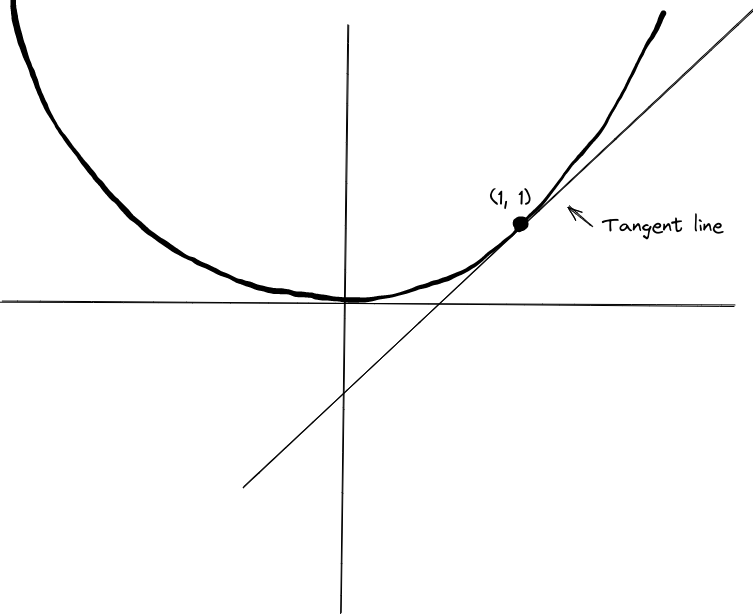
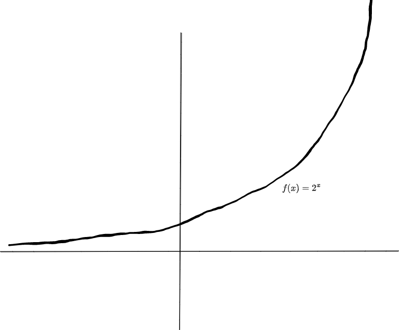
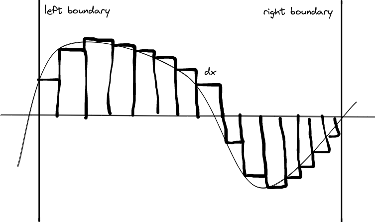
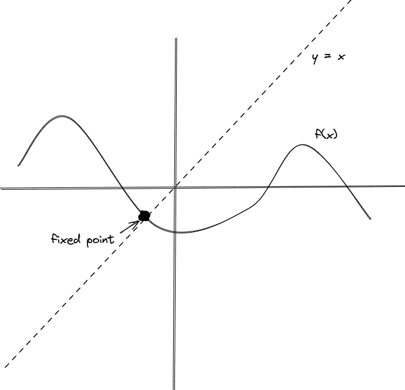
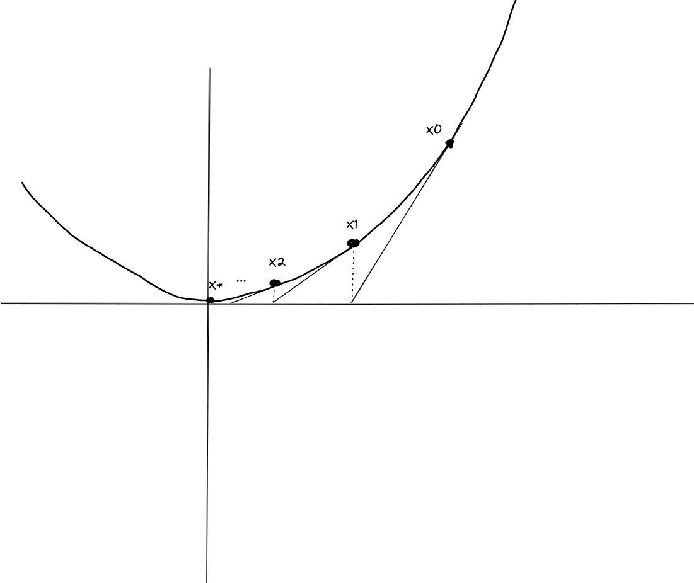
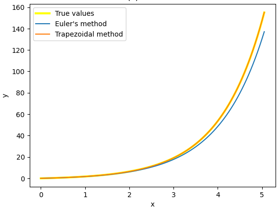

Covering:

- The derivative,
- Fixed point iteration,
- Newton's method,
- Euler, Runge-Kutta, and multistep methods.

-----

## The Derivative

The equation for a line is $y = mx + b$, where $m$ is the "slope" of the line—the difference in $y$ over the difference in $x$, which can also be written, $\frac{\mathrm{d}y}{\mathrm{d}x}$. The "$\mathrm{d}$" is short for "difference" (from Greek $\delta\iota\alpha\varphi o\rho\alpha$ "diafora"), and in fact people also use $\frac{\Delta y}{\Delta x}$ and $\frac{\delta y}{\delta x}$ "(D/d)elta y over (D/d)elta x". There's also a curly "d" $\frac{\partial y}{\partial x}$ that we'll get into later. But, all of these refer to a rate of change, just in slightly different contexts.

The *derivative* is the slope from the best linear approximation to a function. Draw a line through a point, and zoom in on it. If the line intersects the function at another place nearby, you can rotate it a little to get a better approximation. So the line has to only touch at one point—it's *tangent*.


{ width=250px }

Let's compute the derivative of the above function, $y = x^2$, at the point $(x, y) = (1, 1)$. We can add a small change to $x$ and $y$ to get a nearby point on the same function and find the slope of the connecting line:$$\begin{aligned}y&=x^2,\\y + \mathrm{d}y &= (x + \mathrm{d}x)^2\\&\implies \\\mathrm{d}y &= 2x\cdot \mathrm{d}x + (\mathrm{d}x)^2\\&\implies\\\frac{\mathrm{d}y}{\mathrm{d}x} &= 2x + \mathrm{d}x.\end{aligned}$$For very close points the line is nearly tangent and $2x + \mathrm{d}x$ is infinitesimally close to $2x$, so the tangent has slope $2x$. In particular at $x=1$, the derivative is two.

Now, what about those other variants, $\Delta, \delta, \partial$? The first two are used pretty interchangeably to mean a *finite difference*, basically the same idea but we don't use an arbitrarily small $\mathrm{d}x$, we fix it at some finite value. For example, with $\Delta x = 1$ we would get $$\frac{\Delta y}{\Delta x} = \frac{(x + \Delta x)^2 - x^2}{\Delta x} = 2x + \Delta x = 2x + 1.$$Sometimes people use centered differences, because they can be more accurate, like so:
$$\frac{\Delta y}{\Delta x} = \frac{(x + \Delta x)^2 - (x - \Delta x)^2}{2\Delta x} = 2x.$$
The last variant, $\partial$ (called the "partial (derivative)"), means we pretend all variables are constants except the one in the denominator. For example, if we made an additional equation $z = x^2 + y$, then $$\frac{\partial z}{\partial x} = 2x,$$but $$\frac{\mathrm{d}z}{\mathrm{d}x} = 2x + \frac{\mathrm{d}y}{\mathrm{d}x} = 2x + 2x = 4x$$as we need to take into account that $y$ changes when $x$ changes.

-----

## Derivatives of Common Functions

Some of the most common functions are monomials and exponentials. Consider a monomial, $f(x) = x^n$. What is $\frac{\mathrm{d}f}{\mathrm{d}x}$? Well, we have
$$f(x + \mathrm{d}x) = \underbrace{(x+\mathrm{d}x)(x+\mathrm{d}x)\cdots (x+\mathrm{d}x)}_{n\text{ times}}.$$
We can use the distributive property to expand this out. Each binomial, $(x+\mathrm{d}x)$, will lend either an $x$ or a $\mathrm{d}x$ term to the product. If we happen to choose all $x$'s we get the term $x^n$. If we choose a single $\mathrm{d}x$, there are $n$ possibilities for where the $\mathrm{d}x$ came from, so we get $nx^{n-1}\mathrm{d}x$. And so on.
$$f(x+\mathrm{d}x) = x^n + nx^{n-1}\mathrm{d}x + \frac{n(n-1)}{2}x^{n-2}\mathrm{d}x^2 + \cdots.$$
This is known as the [binomial theorem](https://en.wikipedia.org/wiki/Binomial_theorem). When taking the derivative we only care about the first few because $$\frac{\mathrm{d}f}{\mathrm{d}x} = \frac{f(x+\mathrm{d}x)-f(x)}{\mathrm{d}x} = nx^{n-1} + \frac{n(n-1)}{2}x^{n-2}\mathrm{d}x + \cdots,$$
but $\mathrm{d}x$ is infinitesimally small, so everything except $nx^{n-1}$ approaches zero. This gives us the derivative,  $\frac{\mathrm{d}f}{\mathrm{d}x} = nx^{n-1}$. The binomial theorem happens to hold true even if $n$ is not an integer or real number, so it's possible to take the derivative of, say, $f(x) = \sqrt{x} = x^{\frac12}$. Just plug in $n=\frac12$.

Now what about exponentials? For example, what is the derivative of $f(x) = 2^x$?

{width=250px}

If you're familiar with compounding interest (e.g. on loans), you'd expect the function to increase proportional to its value, so $\frac{\mathrm{d}f}{\mathrm{d}x} = c2^x$ for some constant $c$. Working out the math gives us $$\frac{\mathrm{d}f}{\mathrm{d}x} = \frac{2^{x+\mathrm{d}x} - 2^x}{\mathrm{d}x} = \frac{2^{\mathrm{d}x} - 1}{\mathrm{d}x}2^x,$$so $c = \frac{2^{\mathrm{d}x} - 1}{\mathrm{d}x}$. When $\mathrm{d}x = 0$ both the numerator and the denominator are zero, which doesn't make sense. However, if we take successively smaller $\mathrm{d}x$, and compute the limit as $\mathrm{d}x$ goes to zero, we find $$\lim_{\mathrm{d}x\to 0}\frac{2^{\mathrm{d}x}-1}{\mathrm{d}x}\approx 0.69.$$So, $$\frac{\mathrm{d}f}{\mathrm{d}x}\approx 0.69\cdot 2^x = 0.69f(x).$$For $f(x) = 3^x$ we get $$\frac{\mathrm{d}f}{\mathrm{d}x}\approx 1.1\cdot 3^x = 1.1f(x).$$This suggests there's some exponential in between $2^x$ and $3^x$ where $\frac{\mathrm{d}f}{\mathrm{d}x} = 1f$. The base is known as Euler's number, $e$, which is approximately $2.7183$. Two ways to compute it are with the formulae $$\begin{aligned}e &= \lim_{n\to\infty}\left(1+\frac{1}{n}\right)^n&(\text{E.1})\\e&=\frac{1}{0!}+\frac{1}{1!}+\frac{1}{2!}+\frac{1}{3!}+\cdots.&(\text{E.2})\end{aligned}$$
Call the natural logarithm ($\ln$) the logarithm with this base (so $\ln(e^2) = 2$), then for any base $a$, $$a^x = (e^{\ln a})^x = e^{x\ln a}.$$Taking a derivative gives us $$\frac{\mathrm{d} (a^x)}{\mathrm{d}x} = \frac{\mathrm{d} (e^{x\ln a})}{\mathrm{d}x\frac{\ln a}{\ln a}} = \ln a\cdot\frac{\mathrm{d} e^{(x\ln a)}}{\mathrm{d} (x\ln a)} = \ln a\cdot e^{x\ln a} = \ln a\cdot a^x.$$So, throwing back to $f(x) = 3^x$ above, $$\frac{\mathrm{d}(3^x)}{\mathrm{d}x} = \ln 3 \cdot 3^{x},$$and in fact $\ln 3$ is approximately $1.1$.

If you expand out the first formula (E.1) for $e$ with the binomial theorem, you get a sum with each piece converging to (E.2). This second formula comes from the *Maclaurin series* of $e^x$. Most functions you'll come across can be written in a power series as $$f(x) = a_0x^0 + a_1x^1 + a_2x^2+\cdots$$for some constants $a_n$. Notice that we can clear out all terms but the first by evaluating the function at zero: $$f(0) = a_0\cdot 1 + a_1\cdot 0 + a_2\cdot0 + \cdots = a_0.$$If we take a derivative, we get $$\frac{\mathrm{d}f}{\mathrm{d}x} = a_1x^0+2a_2x^1+3a_3x^2+\cdots,$$and evaluating at zero again would give
$$\frac{\mathrm{d}f}{\mathrm{d}x}(0) = a_1.$$In general, taking the derivative $n$ times gives $\frac{\mathrm{d}^nf}{\mathrm{d}x^n}(0) = a_n\cdot n!$. In our special case $e^x$, the derivative is always $e^x$, so we find $$e^0 = a_n\cdot n!\Longleftrightarrow a_n = \frac{1}{n!}.$$The Maclaurin series for $e^x$ is $$e^x = 1 + x + \frac{x^2}{2!} + \frac{x^3}{3!} + \cdots.$$Plugging in $x=1$ gives the formula for $e$.

A Taylor series is a shifted version of this. You compute the Maclaurin series for $g(x) = f(x-\text{shift})$ and then plug in $f(x) = g(x+\text{shift})$ into the Maclaurin series, like so: $$f(x) = f(\text{shift}) + (x-\text{shift})\frac{\mathrm{d}f}{\mathrm{d}x}(\text{shift}) + (x-\text{shift})^2\frac{\mathrm{d}^2f}{\mathrm{d}x^2}(\text{shift})+\cdots.$$Most people don't differentiate between the two. A Taylor series is usually assumed to have no shift unless stated otherwise.

There is a more general idea called *finite element analysis*, where instead of writing $f(x) = \sum a_nx^n$ you choose other basis functions so $f(x) = \sum a_n\phi_n(x)$. For example, if you choose $\phi_n = e^{-nx}$ you might be able to model a damped spring in motion pretty well with only a few coefficients. We'll go over finite element methods in Lecture 4.

-----

## Other Calculus
1. People often use prime notation, writing $y'$ instead of $\mathrm{d}y/\mathrm{d}x$. This should only ever be used for the total derivative. The $n$th derivative can be written as $y^{(n)}$, and it's usually good practice to write $y^{(4)}$ instead of $y''''$ (four primes).
2. The product rule is $(fg)' = f'g + g'f$. Try plugging in the deltas if you wish to prove it.
3. The chain rule is $$\frac{\mathrm{d}(f(g(x))}{\mathrm{d}x} = \frac{\mathrm{d}f(g)}{\mathrm{d}g}\cdot \frac{\mathrm{d}g}{\mathrm{d}x},$$for example with $f(g)=e^{g}$ and $g(x) = x\ln 3$ we get $$\frac{\mathrm{d} e^{x\ln 3}}{\mathrm{d}x} = e^{x\ln 3}\cdot \ln 3.$$I used this trick when computing the derivative of $a^x$ several paragraphs ago.
4. The *integral* is the area under a function (if the function is negative, that area is considered negative). It can be computed by making a bunch of small boxes of width $\mathrm{d}x$ and height $f(x)$, then adding them up:

{width=250px}

7. The derivative of the integral is the original function. Sometimes the integral is called the antiderivative for this reason. (Example: The integral of velocity is how far you've moved, i.e. your position, while the derivative of your position is how fast you're moving, i.e. your velocity.)
8. In general integrals are much harder to compute than derivatives, and many integrals have no closed form. We'll show how to numerically approximate integrals in Lecture 2.
9. Another difficult problem is solving *differential equations*. These show up everywhere in physics (for example, the motion of a damped spring satisfies $f'' + cf'  + kf = 0$ for some constants $c$ and $k$). We'll show how to solve these in a few sections.

-----

## Fixed Point Iteration

{width=250px}

Say you take a function and apply it over and over again. If it's like $f(x) = x^2$ and you start with $x=2$, then the number will get infinitely large. However, if the derivative is between $-1$ and $1$, we get a *contraction mapping* where the range shrinks after every iteration until we're left with just a few fixed points. For example, the only fixed point of $\cos(x)$ is $x\approx 0.7391$.

We can use fixed point iteration to find roots. For example, with the equation $$x^5 - 7x^3 + 3x^2 + x + 2 = 0$$ we can rearrange it to $$x = \sqrt[5]{7x^3 - 3x^2 - x - 2}$$then apply fixed point iteration on the right-hand side (RHS) to get equality when $x\approx 2.362$.

-----

## Newton's Method

{width=250px}

When it converges, Newton's method is usually faster for finding roots. Suppose $f(x)\ne 0$ but we want to find a root $x^*$ where $f(x^*) = 0$. From the first two terms of the Taylor series,
$$0 = f(x^*)\approx f(x) + (x^{*}-x)f'(x),$$
so $$x^*\approx x - \frac{f(x)}{f'(x)}.$$
We ignored powers of $(x^*-x)^2$ or higher in the Taylor series, so there should be some leftover error, but it should get at least squared. Then the number of correct digits should about double every iteration, and we say Newton's method converges quadratically.

For example, with the function $f(x) = x^2-1$ the roots are $x^*=\pm 1$. We know $f'(x) = 2x$, so we should compute $$x^*\approx x - \frac{x^2-1}{2x} = \frac{x}{2}+\frac{1}{2x}.$$If we started with an initial guess of $x=2$, then iteratively updated $x$ with the new approximation, we would get
```
Iteration 0: x = 2.00000
Iteration 1: x = 1.25000
Iteration 2: x = 1.02500
Iteration 3: x = 1.00030
```

We do have to be careful when double roots are present. I'll leave it as a homework problem to investigate this, in particular try applying Newton's method to $f(x) = x^2$. Does it look like quadratic convergence? (Hint: it doesn't.)

-----

## Euler's Method

{width=250px}

As a toy example, say you have the differential equation $$y'(t) = y(t) + 1.$$The exact solution is $y = e^t - 1$, but pretend you don't know how to solve this by hand. You can use Euler's method to approximate the solution using only an initial value $y(0) = y_0$. As in Newton's method we truncate the Taylor series to get $$y(t + h) \approx y(t) + hy'(t).$$We start at $t=0$ and keep adding $h$ and computing $y'$ using our differential equation until we reach $t=t_{\text{end}}$, like so:
$$y_{n+1} = y_n + hy'(t_n) = y_n + h(y_n+1).$$
Each step will introduce an error proportional to $h^2$ from terms we truncated, so the *local truncation error* (LTE) is second order. Taking smaller steps should make each value more accurate, however this also means we take more steps. The number of steps is proportional to $\frac{1}{h}$, so we should expect the error at $t=t_{\text{end}}$ to be proportional to $\frac{h^2}{h}=h$.

Euler's method can be improved by using more than just one $y_n$ in the update. For example, the trapezoidal method (named after the [trapezoidal rule](https://en.wikipedia.org/wiki/Trapezoidal_rule)) solves for $y_{n+1}$ implicitly in the recursion, $$y_{n+1} = y_n + h\frac{y'(t_n)+y'(t_{n+1})}{2} = y_n + h\frac{(y_n+1)+(y_{n+1}+1)}{2},$$which can be rearranged to $$y_{n+1} = \frac{(2+h)y_n + 2h}{2-h}.$$This works for our toy example, but not in general. Say all we know is $$y' = f(t, y)$$for some black box $f$, which means we can't just rearrange terms. Instead, people use fixed point iteration to solve for $y_{n+1}$. To generate an initial guess they use an explicit *predictor* method, such as Euler's method, and then they iterate using an implicit method as a *corrector*.

Other ways to improve Euler's method include creating intermediate points (Runge-Kutta methods), and interpolating using previous points (multistep methods). Wikipedia probably does a better job of explaining [Runge-Kutta methods](https://en.wikipedia.org/wiki/Runge%E2%80%93Kutta_methods) than I will, but here's a brief explanation.

-----

## Runge-Kutta Methods

Runge-Kutta methods are usually written out in a *Butcher tableau*: $$\begin{array}{c|ccccc}t_1=t\\t_2&a_{21}\\t_3&a_{31}&a_{32}\\\vdots&\vdots&&\ddots\\t_s&a_{s1}&a_{s2}&\cdots&a_{s,s-1}\\\hline&b_1&b_2&\dots&b_{s-1}&b_s\end{array}$$The times $t_2, t_3, \dots, t_s$ are fractions of a step. You create intermediate points defined by $$y_{t_n} = f(t + ht_n,\quad y_t + h\sum_{i=1}^{n-1}a_{ni}y_{t_i}),$$and combine them with the last row to get $$y_{t+h} = y_t + h\sum_{i=1}^s b_iy_{t_i}.$$To give a specific example, the Butcher tableau for the midpoint method is $$\begin{array}{c|ccc}0\\\frac12&\frac12\\\hline&0&1\end{array},$$which amounts to $$\begin{aligned}y_{t+\frac12h}&=y_t+\frac12h(t,y_t)\\y_{t+h} &= y_t + hf(t+\frac12h,\quad y_{t+\frac12h})\\&\text{(or put together),}\\y_{t+h} &= y_t+hf(t+\frac12h,\quad y_t+\frac12h(t, y_t)).\end{aligned}$$Let's analyze its convergence rate. From an earlier analysis we know $$y_t+\frac12h(t, y_t) = y(t+\frac12h) + O(h^2)$$where $O(h^2)$ is [Big-O notation](https://web.mit.edu/16.070/www/lecture/big_o.pdf) for "order two". So, $$\begin{aligned}y_t+hf(t+\frac12h,\quad y_t+\frac12h(t, y_t)) &= y_t+hf(t+\frac12h,\quad y(t+\frac12h)+O(h^2))\\(\text{Taylor series on }f(y)\to)&=y_t+hf(t+\frac12h,\quad y(t+\frac12h))+O(h^3)\\&=y_t+hy'(t+\frac12h)+O(h^3)\\(\text{Taylor series on }y'(t)\to)&=y_t+hy'(t)+\frac{h^2}{2}y''(t)+O(h^3).\end{aligned}$$This is exactly the same as the Taylor series for $y(t+h)$: $$y(t+h) = y(t) + hy'(t) + \frac{h^2}{2}y''(t)+O(h^3).$$This means the local truncation error is third order, and the global error is second order. Even though the midpoint method computes $f$ twice per step, you can take larger step sizes and get the same error as with Euler's method, meaning you need less computation overall. Most software (e.g. [scipy](https://docs.scipy.org/doc/scipy/reference/generated/scipy.integrate.RK45.html)) use an order 5 explicit Runge-Kutta method as a predictor, and then follows up with an order 4 implicit method as a corrector.

-----

## Multistep Methods
You can also get higher order methods by interpolating previous points instead of creating intermediary points. These are called [multistep methods](https://en.wikipedia.org/wiki/Linear_multistep_method), and take the general form $$\sum_{n=0}^sa_ny_n = h\sum_{n=0}^sb_nf(t_n, y_n).$$Note I'm assuming the unknown we're solving for is $y_s$, so usually $a_s = 1$ (and $b_s=0$ for explicit methods). For all other timesteps we assume we know the exact solution, so $y_n = y(t_n)$. We want to maximize the order of the method; expanding out the first several terms of the Taylor series (on each side) and equating coefficients of $h^kf^{(k)}$ gives $$\begin{aligned}\sum_{n=0}^s\frac{n^k}{k!}a_n &=\sum_{n=0}^s\frac{n^{k-1}}{(k-1)!}b_n\end{aligned}$$for $k \ge 1$. For $k=0$ there is no $h^0$ term from the right half of the equation, so we get $$\sum_{n=0}^s a_n = 0,$$sometimes called the consistency condition. The explicit Adams-Bashforth methods have the additional restriction $a_{s-1} = -1$ and all remaining $a_i = 0$, so we get a method of the form $$y_s = y_{s-1} + h\sum_{n=0}^{s-1}b_nf(t_n, y_n).$$The implicit Adams-Moulton method is the same, except the summation goes all the way to $s$. Finally, the backwards differentiation formulas (BDF method) are implicit methods with $b_s=1$ and all other $b_i=0$. They take the form $$\sum_{n=0}^sa_ny_n = hf(t_s, y_s).$$The Adams Bashforth and BDF methods with $s$ previous points are order $s$, while the Adams Moulton methods can achieve the theoretical maximum ($s+1$).

-----

\newpage

# Homework Problems
1. Find the Maclaurin series for $\frac{1}{(1-x)^2}$. **Hint:** What is the derivative of $(x-1)^{-1}$?
2. Show that $$f'(x) = \sum_{f(r)=0}\frac{f(x)}{x-r},$$where the roots are counted with multiplicity.
3. **Coding:** Apply Newton's method to $f(x) = x^2$ starting with an initial guess of $x=1$. Why does it not converge quadratically?
4. Create a fixed point method using a Padé approximation of the form $$x^* = f(x^*)\approx \frac{f(x) + \alpha(x^*-x)f'(x)}{1 + \beta (x^*-x)}.$$**Coding:** Use it to find a fixed point for $f(x) = \frac{x^2-2}{x-2}$. For what $\beta$ does it converge?
5. A function is *Lipschitz continuous* if it is continuous and $\frac{|f(x) - f(y)|}{|x-y|} \le K$ for some constant $K$. Show that if a function is Lipschitz continuous, then any Runge-Kutta or multistep method will have a GTE with order one less than the LTE. For example, the local truncation error of Euler's method is $O(h^2)$ but it's global truncation error is only $O(h)$.
6. Propose a third order Runge-Kutta method (unless otherwise specified, order refers to the global truncation error). 
7. **Coding:**
	1. Code up your method using the test function $f(x) = e^x$.
	2. Create a log-log plot showing error against time deltas (between $10^{-0}$ and $10^{-3}$).
	3. Verify that the slope is three.
	4. Math question: Why does the slope equal the order?
