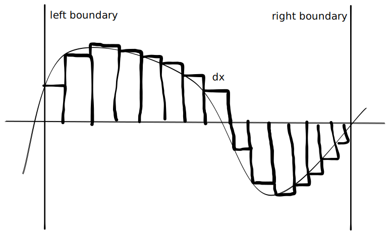

Covering:

- Quadrature a.k.a. numerical integration,
- Finite difference methods and correctors.

-----

# Quadrature
*Latin: To Divide into Boxes*

Last time we briefly mentioned that an integral is the area below a curve. You can approximate it as a *Riemann sum* by making boxes of width $\Delta x$ and height $f(x)$. A negative height corresponds to a negative area.

{ width=250px }

Assuming the left boundary is at $0$ and the right boundary is at $x$, the total area is $$F(x) := f(0)\Delta x + f(\Delta x)\Delta x + f(2\Delta x)\Delta x + \cdots + f(x-\Delta x)\Delta x.$$Taking a finite difference of size $\Delta x$ gives back the original function: $$\frac{F(x+\Delta x) - F(x)}{\Delta x} = f(x).$$As $\Delta x$ gets smaller the value gets more accurate, and for an infinitesimally small $\text{d}x$ we get the integral, written as $$\int_0^xf(x)\text{d}x.$$A Riemann sum is a flat approximation (degree zero) of $f(x)$ at each summand point, and is not very accurate except for very small $\Delta x$. A linear approximation (degree one), such as $\frac{f(x)+f(x+\Delta x)}{2}\Delta x$, is a little better. The shape of each box would become a trapezoid, so this is known as the trapezoidal rule. [Simpson's rule](https://en.wikipedia.org/wiki/Simpson%27s_rule) is a quadratic interpolation (degree two). In general, increasing the degree gives the [Newton-Cotes formulas](https://en.wikipedia.org/wiki/Newton%E2%80%93Cotes_formulas), however these are not very stable for high degree approximations. These also still require evaluating the function hundreds of times to get a decent approximation.

However, we should be able to do better. You can determine a degree $n$ polynomial exactly with only $n+1$ evaluations, and taking the integral of a polynomial is easy. Most functions can be approximated pretty well with a relatively low degree polynomial. Modern quadrature is based on this idea. You find the right points and weights, so that if your function were a polynomial it would return the exact integral. If it's not quite, it will still be pretty close. This is known as [Gauss-Legendre quadrature](https://en.wikipedia.org/wiki/Gauss%E2%80%93Legendre_quadrature).

You can also use other easy-to-integrate functions, e.g. using a sum of cosines gives [Clenshaw-Curtis quadrature](https://en.wikipedia.org/wiki/Clenshaw%E2%80%93Curtis_quadrature). When performing quadrature people usually assume the bounds on the integral are between $-1$ and $1$, and then scale the specific points and weights if it's not.

Any degree $n$ polynomial can be written as a sum of [Legendre polynomials](https://en.wikipedia.org/wiki/Legendre_polynomials), $P_0, P_1, \dots, P_n$ (they *span* the degree $n$ polynomials). That's usually true for any random polynomials you'd grab, but these are special because $$\int_{-1}^1 P_iP_j\ \text{d}x= 0\quad\text{if}\quad i\ne j.$$If $f$ were a degree $2n+1$ polynomial we could divide it by $P_{n+1}$, getting $f = P_{n+1}Q + R$ with $Q$ the quotient and $R$ the remainder having degrees $\le n$. Then $$\int_{-1}^1 P_{n+1}Q + R\ \text{d}x = \int_{-1}^1 P_{n+1}\left(\sum_{i=0}^n c_iP_i\right)\ \text{d}x + \int_{-1}^1R\ \text{d}x.$$Everything from the first integral will evaluate to zero, so $$\int_{-1}^1 f\ \text{d}x = \int_{-1}^1R\ \text{d}x.$$We've reduced the integral of a $2n+1$ degree polynomial to that of an $n$ degree polynomial. All degree $n$ polynomials can be integrated using any $n+1$ points, but we want to make sure $P_{n+1}\left(\sum_{i=0}^n c_iP_i\right)$ disappears, so we use the roots of $P_{n+1}$ as our quadrature points. Finding the weights involves solving the equations $$\begin{aligned}\int_{-1}^1 P_0\ \text{d}x &= \sum_{i=0}^{n+1}w_i P_0(x_i)\\\int_{-1}^1 P_1\ \text{d}x &= \sum_{i=0}^{n+1}w_i P_1(x_i)\\&\vdots\\\int_{-1}^1 P_n\ \text{d}x &= \sum_{i=0}^{n+1}w_i P_n(x_i).\end{aligned}$$Overall, the Gauss-Legendre integration rule with $n$ points will exactly integrate a degree $2n-1$ polynomial. Gauss figured out the roots and weights (by hand) up to $n=7$. Today people typically approximate the roots using Newton's method or the Golub-Welsch algorithm. As an aside, the Greeks performed [quadrature using triangles](https://en.wikipedia.org/wiki/Quadrature_of_the_Parabola) to evaluate the integral of a parabola.

-----

# Finite Difference Methods

## Introduction
In physics, the heat equation relates the change in temperature $u$ of an object to the derivative of temperature in each direction: $$\frac{\partial u}{\partial t} = \frac{\partial^2 u}{\partial x_1^2} + \frac{\partial^2 u}{\partial x_2^2} + \cdots + \frac{\partial^2 u}{\partial x_n^2},$$or more concisely, $$\dot{u} = \nabla^2 u.$$Generally physicists put dots over variables to mean "time derivative", and $\nabla$ is the gradient operator $$\nabla = \begin{bmatrix}\frac{\partial}{\partial x_1}\\\frac{\partial}{\partial x_2}\\\vdots\\\frac{\partial}{\partial x_n}\end{bmatrix}.$$$\nabla^2$ is an abuse of notation for $\nabla\cdot (\nabla u)$ where $\cdot$ is the dot product which means to element-wise multiply the two vectors and take their sum. So, $$\nabla^2 u = \nabla\cdot(\nabla u) = \begin{bmatrix}\frac{\partial}{\partial x_1}\\\frac{\partial}{\partial x_2}\\\vdots\\\frac{\partial}{\partial x_n}\end{bmatrix}\cdot \begin{bmatrix}\frac{\partial u}{\partial x_1}\\\frac{\partial u}{\partial x_2}\\\vdots\\\frac{\partial u}{\partial x_n}\end{bmatrix} = \frac{\partial}{\partial x_1}\frac{\partial u}{\partial x_1} + \frac{\partial}{\partial x_2}\frac{\partial u}{\partial x_2} + \frac{\partial}{\partial x_3}\frac{\partial u}{\partial x_3}$$which equals the right hand side of our original equation.

In our universe we have three dimensions so $n=3$, and usually $x_1, x_2, x_3$ are the three coordinate axes. Due to [chirality](https://en.wikipedia.org/wiki/Chirality_(chemistry)) there are two different arrangements of coordinates. Humanity and mathematicians are biased towards the "[right-handed rule](https://en.wikipedia.org/wiki/Right-hand_rule)" but ironically our universe is [left-handed](https://www.nature.com/articles/524008b). It should also be pointed out that $x_1, x_2, x_3$ do not have to be the standard coordinates. Any three coordinates (including curves) are acceptable as long as they can be mapped back to the standard coordinates continuously. Also, [general relativity](https://en.wikipedia.org/wiki/Introduction_to_general_relativity) says our universe does not use these standard coordinates anyway... but they're a good enough approximation for our uses.

## Stencils
We're going to start with a simple example, a flat sheet of metal with two dimensions. Also, we're only going to find its steady state, where $\dot{u} = 0$.

The finite difference for the first derivative is $$\frac{\partial u}{\partial x}\approx \frac{u(x + \Delta x) - u(x)}{\Delta x}.$$Taking a finite difference of this gives an approximation for the second derivative: $$\frac{\partial^2 u}{\partial x^2} = \frac{\partial}{\partial x}\frac{\partial u}{\partial x} \approx \frac{\frac{u(x+\Delta x) - u(x)}{\Delta x} - \frac{u(x) - u(x - \Delta x)}{\Delta x}}{\Delta x} = \frac{u(x+\Delta) - 2u(x) + u(x-\Delta)}{\Delta x^2}.$$
Adding this for both directions ($x_1$ and $x_2$) gives a finite difference stencil, $$\begin{bmatrix}0& \frac{1}{\Delta x_2^2} & 0\\\frac{1}{\Delta x_1^2} & -\frac{2}{\Delta x_1^2} - \frac{2}{\Delta x_2^2} & \frac{1}{\Delta x_1^2}\\0 & \frac{1}{\Delta x_2^2} & 0\end{bmatrix}.$$If the spacing between horizontal and vertical points is the same the kernel becomes $$\frac{1}{\Delta x^2}\begin{bmatrix}0&1&0\\1&-4&1\\0&1&0\end{bmatrix}.$$We can also construct a 9-point stencil by rotating this by $45^\circ$. Note that the spacing along the diagonal is $\Delta x\sqrt2$, so our new stencil will be of the form $$\frac{\alpha}{\Delta x^2}\begin{bmatrix}0&1&0\\1&-4&1\\0&1&0\end{bmatrix} + \frac{1-\alpha}{2\Delta x^2}\begin{bmatrix}1&0&1\\0&-4&0\\1&0&1\end{bmatrix}.$$Any $\alpha$ is fine, but when adding in correctors it's useful to choose $\alpha = 2/3$ giving the 9-point stencil $$\frac{1}{6\Delta x^2}\begin{bmatrix}1&4&1\\4&-20&4\\1&4&1\end{bmatrix}.$$I would argue that due to the [Hex theorem](https://en.wikipedia.org/wiki/Jordan_curve_theorem#Discrete_version) (see also slides 24-30 [here](https://cseweb.ucsd.edu/classes/sp18/cse152-a/lec5.pdf)) everyone should be using 7-point stencils of the form $$\frac{1}{\Delta x^2}\begin{bmatrix}\alpha&\beta&0\\\beta&-2\alpha-2\beta&\beta\\0&\beta&\alpha\end{bmatrix},$$but that's more of a personal opinion. Maybe instead people could use hexagonal coordinate systems, as [hexagons are the bestagons](https://youtu.be/thOifuHs6eY).

Anyway, assuming our metal sheet is $1\text{ meter}\times 1\text{ meter}$, we can divide it into an $n+1\times n+1$ grid of points so $\Delta x = 1/n$. For the 5-point stencil we need to solve the equations $$\frac{1}{\Delta x^2}\left[-4u_{ij}+u_{i+1,j}+u_{i-1,j}+u_{i,j+1}+u_{i,j-1}\right] \approx \frac{\partial^2 u_{ij}}{\partial x_1^2}+\frac{\partial^2 u_{ij}}{\partial x_2^2} = 0$$for every $(i, j)$ on our grid. Each of these approximations is at least first order. It's a centered difference though, which can only have even order. If you write out the Taylor series for $f(x\pm \Delta x)$ you get $$f(x) \pm \Delta xf'(x) + \frac{\Delta x^2}{2}f''(x) \pm O(\Delta x^3)$$but the $+$ and $-$ cancel in a centered difference. Hence our 5-point stencil cannot be first order, it must be at least second order. We'll show it is exactly second order in a little bit, but first let's talk about boundary conditions.

## Boundary Conditions
At the left edge we don't have a $u_{-1, j}$ as $0 \le i \le n$, so we need to specify boundary conditions. *Von Neumann* boundary conditions make the assumption that the derivative is zero at edges, so at the left edge we would replace the horizontal second derivative with a first derivative, like so: $$\frac{1}{\Delta x^2}[-2u_{0j}+u_{0,j+1} + u_{0,j-1}] + \frac{1}{2\Delta x}[-3u_{0j}+4u_{1j}-u_{2j}] \approx \frac{\partial^2 u_{0j}}{\partial x_2^2} + \frac{\partial u_{0j}}{\partial x_1} = 0 + 0 = 0,$$using the second-order difference for $\partial u/\partial x_1$ to match the order of the interior points. We could also use *Dirichlet* boundary conditions, where we assume $u$ is zero everywhere except within our grid. If we want to simulate the edge of the metal sheet being heated up, we could also choose a nonzero boundary. Other possibilities are reflections ($u_{-1j} = u_{1j}$) or wrapping ($u_{-1j} = u_{nj}$). Dirichlet boundaries are usually easier to code up.

## Matrix Form
There are $O(n^2)$ equations, which is a lot, so usually people represent them in matrix form. First they flatten the rows into a single list of points, usually by concatenation but sometimes red-black ordering is preferred. Then they put the stencil coefficients in the correct locations in the matrix and solve the equation programatically. If you chose to concat the rows together like a sane person, and didn't try something crazy like a [Hilbert curve](https://en.wikipedia.org/wiki/Hilbert_curve), the matrix will have five diagonals, with $-4$ along the main diagonal ($M_{ii} = -4$), $+1$ along the super/sub diagonals ($M_{i, i\pm 1} = 1$), and $+1$ at a distance $N=n+1$ from the main diagonal ($M_{i, i\pm N} = 1$).
$$M = \frac{1}{\Delta x^2}\begin{bmatrix}-4&1&0&0&\cdots&1&0&0&\cdots\\1&-4&1&0&\cdots&0&1&0&\cdots\\0&1&-4&1&\cdots&0&0&1&\cdots\\0&0&1&-4&\cdots&0&0&0&\cdots\\\vdots&\vdots&\vdots&\vdots&\ddots&\vdots&\vdots&\vdots&\ddots\\1&0&0&0&\cdots&-4&1&0&\cdots\\0&1&0&0&\cdots&1&-4&1&\cdots\\0&0&1&0&\cdots&0&1&-4&\cdots\\\vdots&\vdots&\vdots&\vdots&\ddots&\vdots&\vdots&\vdots&\ddots\end{bmatrix}.$$The equation to solve is $Mu_\text{flattened} = 0$, as well as the boundary conditions. You can use Gaussian elimination to solve this system of equations. You repeatedly subtract equations (rows in the matrix) until you're left with a single variable, then substitute the solved value in and continue to find new variables. Here's an example with three equations: $$\begin{aligned}1x + 1y + 1z &=6\\1x+0y+1z&=4\\0x+1y+2z&=8\\\Longleftrightarrow\\\begin{bmatrix}1&1&1\\1&0&1\\0&1&2\end{bmatrix}\begin{bmatrix}x\\y\\z\end{bmatrix}&=\begin{bmatrix}6\\4\\8\end{bmatrix}\\\text{subtract first row from second}\\\begin{bmatrix}1&1&1\\0&-1&0\\0&1&2\end{bmatrix}\begin{bmatrix}x\\y\\z\end{bmatrix}&=\begin{bmatrix}6\\-2\\8\end{bmatrix}\\\text{add second row to third}\\\begin{bmatrix}1&1&1\\0&-1&0\\0&0&2\end{bmatrix}\begin{bmatrix}x\\y\\z\end{bmatrix}&=\begin{bmatrix}6\\-2\\6\end{bmatrix}.\end{aligned}$$The last equation is $0x+0y+2z = 6$ so $z=3$. Similarly we find $y=2$. From here it isn't hard to substitute into the first equation to find $x=1$.

In our pentadiagonal system, all nonzero coefficients are within a band of $\pm N$ from the main diagonal, so we need to subtract at most $2N$ equations to isolate a single variable. We have $N^2$ variables, so it takes $O(2N)\cdot N^2 = O(N^3)$ time to solve this system of equations. For $\Delta x = 10^{-3}$ this would take $O(10^9)$, or about ten seconds of computation if you really optimize your code and write in C++. Our method is second-order, so the solution would only be correct wthin $\pm O(10^{-6})$. Machine precision would be correct to $10^{-15}$ or so.

We don't just have to solve for the steady state; we can also move forward in time using an Euler-like method. Using superscripts to denote time, the trapezoidal method would give us $$u^{t+\Delta t} = u^t + \frac{\Delta t}{2}\left[Mu^{t} + Mu^{t+\Delta t}\right],$$which can be rearranged to $$\left(\frac{\Delta t}{2}M-I\right)u^{t+\Delta t} =\left(\frac{\Delta t}{2}M+I\right)u^{t}$$where $I$ is the identity matrix, meaning $Ix = x$ for any $x$. It has ones along the main diagonal and zeros everywhere else.

## Order in the Space Dimension
Now let's actually prove the order of the five-point stencil. To simplify notation, let the $x$ subscript refer to $\frac{\partial}{\partial x_1}$ and $y$ refer to $\frac{\partial}{\partial x_2}$, so $u_{xxy} = \frac{\partial^3 u}{\partial x_1^2\partial x_2}$. Also let $h = \Delta x$. Expanding out the Taylor series for the stencil gives $$\begin{aligned}\frac{1}{\Delta x^2}&[-4u_{00}+u_{10}+u_{-1,0}+u_{01}+u_{0,-1}]\\=\frac1{h^2}[&-4u \\&+(u+hu_x+\frac{h^2}{2}u_{xx}+\frac{h^3}{6}u_{xxx}+\frac{h^4}{24}u_{xxxx} + O(h^5))\\&+(u-hu_x+\frac{h^2}{2}u_{xx}-\frac{h^3}{6}u_{xxx}+\frac{h^4}{24}u_{xxxx} - O(h^5)\\&+(u+hu_y+\frac{h^2}{2}u_{yy}+\frac{h^3}{6}u_{yyy}+\frac{h^4}{24}u_{yyyy}+O(h^5))\\&+(u-hu_y+\frac{h^2}{2}u_{yy}-\frac{h^3}{6}u_{yyyy}+\frac{h^4}{24}u_{yyyy}-O(h^5))\\&]\\&=u_{xx}+u_{yy}+\frac{h^2}{12}[u_{xxxx}+u_{yyyy}]+O(h^4).&\end{aligned}$$Because it is centered, the $O(h^5)/h^2$ terms cancel out, and we're left with the $O(h^4)$ on the right. The largest contributor to the error is the $\frac{h^2}{12}[u_{xxxx} + u_{yyyy}]$ term, so we have a second order method. If we could evaluate $u_{xxxx}+u_{yyyy}$ we could add a correction and get an order four method. One way to do that is by using a larger stencil, like a 25-point stencil. For the Poisson equation we can use another trick.

## Corrector
The Poisson equation is very similar to the heat equation; it takes the form $$\nabla^2 u = f$$and solves for the potential $u$ given a distribution of charges $f$. Notice that $$u_{xxxx}+u_{yyyy} = \nabla^2[u_{xx}+u_{yy}]-2u_{xxyy} = \nabla^2(\nabla^2 u) - 2u_{xxyy} = \nabla^2 f - 2u_{xxyy}.$$The correction we need is $$\nabla^2 u + \frac{h^2}{6}u_{xxyy} = f + \frac{h^2}{12}\nabla^2 f.$$We can approximate $u_{xxyy}$ with a nine point stencil. The Taylor series gives $$u_{\pm 1, \pm 1} = u \pm hu_x\pm hu_y+\frac{h^2}{2}(u_{xx}\pm 2u_{xy}+u_{yy})\pm \cdots.$$If we average all four corners together, everything should cancel except for even terms in both $x$ and $y$: $$\frac{1}{4}[u_{11}+\cdots] = u + \frac{h^2}{2}[u_{xx}+u_{yy}] + \frac{h^4}{24}[u_{xxxx}+6u_{xxyy}+u_{yyyy}]+O(h^6),$$where the six arises because $u_{xxyy} = u_{xyxy} = \cdots = u_{yyxx}$. Similarly, we find the average of the other four points is $$\frac{1}{4}[u_{10}+\cdots] = u + \frac{h^2}{4}[u_{xx}+u_{yy}]+\frac{h^4}{48}[u_{xxxx}+u_{yyyy}]+O(h^6).$$Then $$u - \frac{2}{4}[u_{10}+\cdots]+\frac{1}{4}[u_{11}+\cdots] = \frac{h^4}{4}u_{xxyy} + O(h^6).$$So our stencil to get $\frac{h^2}{6}u_{xxyy}$ is $$\frac{1}{6h^2}\begin{bmatrix}1&-2&1\\-2&4&-2\\1&-2&1\end{bmatrix}.$$Adding this to the 5-point stencil gives the corrected equation $$\frac{1}{6h^2}\begin{bmatrix}1&4&1\\4&-20&4\\1&4&1\end{bmatrix}u = f + \frac{h^2}{12}\nabla^2f.$$Usually we don't know $\nabla^2f$, but we can approximate it using the same 9-point stencil! This correction gives us an order four method; to get the same error as before we would only need $\Delta x = 1/32$ and our algorithm would run in a few milliseconds.