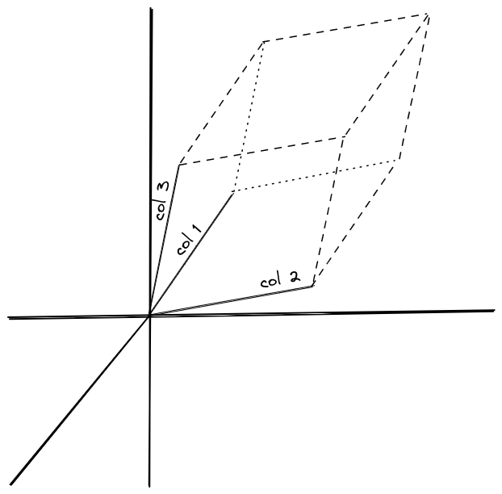

Covering:

- Linear differential equations,
- Matrix fundamentals,
- The QR Algorithm,
- Newton-like methods,
- Stiffness.

-----

# Linear Differential Equations

A *linear transformation* is a function $T(x)$ that applies some scaling and rotation to $x$. It's linear in the sense that $$T(\alpha x) = \alpha T(x)\quad\text{and}\quad T(x + y) = T(x) + T(y).$$Matrices are one such linear transformation. They originate from solving a series of equations, as we saw last week. For example, $$\begin{aligned}a_{11}x_1 + a_{12}x_2 &= b_1\\a_{21}x_1 + a_{22}x_2 &= b_2\end{aligned}$$could be written in matrix form as $Ax = b$ where $$A=\begin{bmatrix}a_{11}&a_{12}\\a_{21}&a_{22}\end{bmatrix};\quad x=\begin{bmatrix}x_1\\x_2\end{bmatrix};\quad\text{and }b=\begin{bmatrix}b_1\\b_2\end{bmatrix}.$$Usually capital letters refer to matrices, and their miniscule counterparts are the entries. Many authors will bold vectors, i.e. $A\textbf{x} = \textbf{b}$, but I will not do so. A *linear differential equation* takes the form $$y' = Ay$$for some vector of functions $$y = \begin{bmatrix}y_1\\y_2\\\vdots\\y_n\end{bmatrix}$$and an $n\times n$ matrix $A$. You could have higher derivative terms, but by repeatedly adding variables $z = y'$ you can reduce it to the above form. As in the one-dimensional equation $y' = ay$, the solutions for $y'=Ay$ are $$y = e^{At}y(0) = y(0) + Aty(0) + \frac{(At)^2}{2!}y(0) + \cdots$$where we define $e^{At}$ through its Taylor series. If we can find two solutions, say $y$ and $z$, then their sum is also a solution, as $$(y+z)' = y'+z' = Ay + Az = A(y+z),$$and similarly $$(\alpha y)' = A(\alpha y).$$This is known as *superposition* and is why these differential equations are called linear. To calculate $e^{At}$ we need to find vectors $v$ that only get scaled by $A$ and not rotated, i.e. $$Av = \lambda v$$for some constant $\lambda$. These are known as *eigenvectors* which is German for "particular direction". As $A$ is a linear transformation from $n$ dimensions to $n$ dimensions, we expect there to be $n$ eigenvectors that span this space, and so we could write $$Ay(0) = A\sum_{i=1}^{n} v_i.$$Then $$A^ky(0) = A^k\sum_{i=1}^nv_i = \sum_{i=1}^nA^kv_i = \sum_{i=1}^n\lambda_i^kv_i,$$and our Taylor series becomes $$y = e^{At}y(0) = \sum_{k=0}^{\infty}\sum_{i=1}^n\frac{\lambda_i^kt^k}{k!}v_i = \sum_{i=1}^n\sum_{k=0}^{\infty}\frac{\lambda_i^kt^k}{k!}v_i = \sum_{i=1}^ne^{\lambda_it}v_i.$$The eigenvectors are determined up to a constan, so we just have to make them satisfy the equation at $t=0$. The tricky part is finding the corresponding eigenvalues $\lambda_i$. One way is to use the QR Algorithm, but before we introduce that we need to go over some more of the fundamentals.

-----

# Matrix Fundamentals

Matrix multiplication is done by treating the second matrix as a list of columns, so $$AB = \begin{bmatrix}Ab_1&Ab_2&\dots&Ab_n\end{bmatrix}.$$In general, matrices do not commute, so $AB$ is not necessarily equal to $BA$. The identity matrix $I$ sends every vector back to itself, so $Ix = x$ for all $x$ and it does commute with all matrices. It has ones along the main diagonal and zeroes everywhere else: $$I = \begin{bmatrix}1&0&0&\cdots&0\\0&1&0&\cdots&0\\0&0&1&\cdots&0\\\vdots&\vdots&\vdots&\ddots&\vdots\\0&0&0&\cdots&1\end{bmatrix}.$$

{ width=250px }

The determinant of matrix, written $\det A$ or $|A|$, is the volume of a parallelpiped with vectors formed from the columns of $A$, and can be computed recursively. Suppose $$A =
\left[\begin{array}{c|c}
a_{11} & a_{1,[2\dots n]}\\
\hline a_{[2\cdots n], 1}&M_{11}\\
\end{array}\right]$$where $M_{11} = a_{[2\dots n], [2\dots n]}$ is an $(n-1)\times (n-1)$ *minor* matrix. The subscripts denote that we are removing the first row and first column from our original matrix. We can imagine that $M_{11}$ describes an $n-1$ dimensional parallelpiped, and $a_{11}$ is the height in the last dimension, so the volume would be $a_{11}|M_{11}|$. However, we still have to add in all the pieces from $a_{21}|M_{21}|, a_{31}|M_{31}|,$ etc.

More rigorously, we can name our dimensions and use a wedge product. Say the $i$th row has direction $\hat{n}_i$, then $$\text{direction }|M_{i1}| = \hat{n}_1\wedge\hat{n}_2\wedge\cdots\wedge\hat{n}_{i-1}\wedge\hat{n}_{i+1}\wedge\cdots\wedge\hat{n}_n,$$i.e. a wedge product of all the directions except $\hat{n}_i$. I'll write this as $\hat{V}_{-i}$ for short. This allows us to orient directions. The right hand rule says that a positive area is defined as sweeping counterclockwise from one vector to another, and a negative area is the reverse. In wedge notation this is simply $$\hat{n}_i\wedge \hat{n}_j = -\hat{n}_j\wedge \hat{n}_i,$$which also implies $$\hat{n}_i\wedge\hat{n}_i = -\hat{n}_i\wedge\hat{n}_i = 0$$(you're sweeping zero area between a vector and itself). Applying this to our determinant we find $$\hat{n}_i\wedge \hat{V}_{-i} = (-1)^i\hat{n}_1\wedge\hat{n}_2\wedge\cdots\wedge\hat{n}_n.$$Our determinant is then $$a_{11}|M_{11}| - a_{21}|M_{21}| + a_{31}|M_{31}| - \cdots \pm a_{n1}|M_{n1}|$$where we alternate between plus and minus. As $\hat{n}_i\wedge\hat{n}_i = 0$, we can add rows to each other without changing the determinant. Also, I should point out that we did not have to choose the first column to isolate, e.g. we could have chosen the second column and gotten the sum $$-a_{12}|M_{12}| + a_{22}|M_{22}|-a_{32}|M_{32}|+\cdots\mp a_{n2}|M_{n2}|.$$If you expand out the determinants recursively you would get $$|A| = \sum_{\sigma\text{ is a permutation}}a_{1\sigma_1}a_{2\sigma_2}\cdots a_{n\sigma_n}(-1)^{\text{\# inversions in }\sigma}.$$From this last definition, it becomes apparent that we could transpose the rows and columns and have the same determinant, i.e. $$|A^T| = |A|.$$Geometrically, transposing reverses the rotation but preserves the scaling that $A$ applies. (It also mirrors the imaginary part, to really reverse the rotation you also need to take the complex conjugate, i.e. replace every $+\sqrt{-1}$ with $-\sqrt{-1}$. This doesn't affect the volume.)

A matrix is said to be *singular* if its determinant is zero. Any nonsingular matrix has an inverse $A^{-1}$ that satisfies $AA^{-1} = A^{-1}A = I$, and can be computed with $$A^{-1} = \frac{1}{|A|}\begin{bmatrix}+|M_{00}|&-|M_{01}|&+|M_{02}|&\cdots&\pm|M_{0n}|\\-|M_{10}|&+|M_{11}|&-|M_{12}|&\cdots&\mp|M_{1n}|\\+|M_{20}|&-|M_{21}|&+|M_{22}|&\cdots&\pm|M_{2n}|\\\vdots&\vdots&\vdots&\ddots&\vdots\\\pm|M_{n0}|&\mp|M_{n1}|&\pm|M_{n2}|&\cdots&+|M_{nn}|\end{bmatrix}$$If you directly plug in $AA^{-1}$ you will find you get $\frac{|A|}{|A|} = 1$ along the diagonals and zero everywhere else. As multiplication is not commutative, $\frac{A}{B}$ doesn't make sense. You have to differentiate between right and left division, which is why people usually write $A / B = AB^{-1}$ and $B \backslash A = B^{-1}A$.

Numerically it would be very slow to compute the determinant or inverse using the formulae above. A better way is through *Gaussian elimination*, adding and subtracting rows from one another to get the matrix in a nicer format, such as a diagonal matrix that has zeros everywhere except the main diagonal. If you keep track of which additions/subtractions you made, you can apply the same modifications to $I$ and then divide the rows by the diagonals to get $A^{-1}$. To solve a system of equations $Ax = b$ you can do the same with the vector $b$.

If a matrix does not have an inverse, there must be some nonzero vector $x$ such that $Ax = 0$, otherwise $$Ax=0\implies x = A^{-1}0 = 0.$$So, $|A| = 0$ iff $Ax = 0$ has a nonzero solution. We can transform the eigenvalue equation $$Av - \lambda v = 0$$into $|A-\lambda I| = 0$, which will be a degree $n$ polynomial in terms of $\lambda$, known as the *characteristic polynomial*. Taking a transpose, we also find that $$|A^T-\lambda I| = 0,$$so the eigenvalues of $A^T$ and $A$ are the same.

One way to find eigenvalues is using fixed point iteration or Newton's method to find the roots of this polynomial equation. Another way is to repeatedly multiply by $A$ and normalize, until the largest eigenvalue pops out, i.e. $$\lambda_\text{max} \approx \frac{A^{k+1}x}{A^{k}x}$$for some initial $x$ and a large enough $k$. As $$A^kx = A^k\sum_{i=1}^n v_i = \sum_{i=1}^n \lambda_i^kv_i$$the largest eigenvalue will increase exponentially faster than the next largest, and $$A^kx\to \lambda_\text{max}^kv.$$To get the smallest eigenvalue you could multiply by negative powers, and to get any other eigenvalue you can insert a shift, using the matrix $A+\lambda_\text{shift}I$ instead.

-----

# QR Algorithm

A matrix can be diagonalized into the form $$A = S\Lambda S^{-1}$$for a rotation matrix $S$ and diagonal matrix $\Lambda$. If $Av = \lambda v$, then $$\Lambda v = S(Av)S^{-1} = S\lambda S^{-1}v = \lambda v,$$so the eigenvalues of $A$ and $\Lambda$ are the same, which will just be the entries along $\Lambda$'s diagonal. Also, the eigenvectors of $A$ will be the columns of $S$. For this reason it is known as the eigendecomposition.

A similar technique is the QR decomposition, which expresses $A$ as the product of a rotation matrix $Q$ and an upper triangular matrix $R$. An upper triangular matrix is zero below the main diagonal. The conjugate transpose of a rotation matrix is a rotation in the opposite direction, so $Q^{T} = Q^{-1}$, and $Q^TQ^{-1} = I$. For this reason rotation matrices are also called *unitary*, and in fact every unitary matrix is a rotation matrix, although the rotation axis may be in a higher-dimensional space than the vectors.

The QR algorithm is as simple as iteratively decomposing $A_k\to Q_kR_k$ and setting $A_{k+1}\leftarrow R_kQ_k$. As $$A_{k+1} = Q_k^{-1}A_kQ_k$$the eigenvalues do not change between iterations. It turns out that $A_k$ will converge to $\Lambda$. Also, if we set $$Q = \lim_{k\to\infty}Q_1Q_2Q_3\cdots Q_k,$$then $Q$ is the rotation matrix that diagonalizes $A$, i.e. $Q = S$.

*Proof:* The product of two upper triangular matrices is still upper triangular. Let $$R = R_k\cdots R_3R_2R_1$$which is upper triangular. Any matrix can be written as a product of lower and upper triangular matrices, so also let $$S^{-1} = LU.$$This product is unique if we assume $L$ has ones along its main diagonal. A little manipulation gives us $$\begin{aligned}
S\Lambda^kL\lambda^{-k} &= S\Lambda^kS^{-1}U^{-1}\Lambda^{-k}\\
&= A^kU^{-1}\Lambda^{-k}\\&=(Q_1Q_2Q_3\cdots Q_k)(R_k\cdots R_3R_2R_1)U^{-1}\Lambda^{-k}\\
&=QRU^{-1}\Lambda^{-k}.\end{aligned}$$Notice that $\Lambda^kL\Lambda^{-k}$ is lower triangular, so its entries are $$(\Lambda^kL\Lambda^{-k})_{ij} = L_{ij}\left(\frac{\Lambda_{ii}}{\Lambda_{jj}}\right)^k.$$Assuming that the eigenvalues are increasing (i.e. $\Lambda_{ii}>\Lambda_{jj}$ for $i>j$), then all terms except the diagonal will converge to zero, leaving the identity matrix. Hence, $$S = Q(RU^{-1}\Lambda^{-k}).$$The QR decomposition is also unique, so $S = Q$ and $I = RU^{-1}\Lambda^{-k}$. If $Q_k$ and $R_k$ converge, then it must be to $I$ and $\Lambda$ respectively. Then, for large enough $k$ we find $$A_k = Q_kR_k = \Lambda.$$The running time of QR decomposition for an $n\times n$ matrix is $O(n^3)$. It should converge linearly, as $\Lambda^kL\Lambda^{-k}\to I$ at a rate $(\lambda_{n-1}/\lambda_n)^k$. Modern adaptations of the QR algorithm also shift the eigenvalues each iteration, and do not fully compute the QR decomposition, to get cubic convergence with an $O(n^2)$ running time.

We can use the QR algortihm to find the roots of a polynomial. The matrix $$ \begin{bmatrix}
0&1&0&0&\cdots&0&0\\
0&0&1&0&\cdots&0&0\\
0&0&0&1&\cdots&0&0\\
0&0&0&0&\cdots&0&0\\
\vdots&\vdots&\vdots&\vdots&\ddots&\vdots&\vdots\\
0&0&0&0&\cdots&0&1\\
-a_{0}&-a_{1}&-a_{2}&-a_{3}&\cdots&-a_{n-2}&-a_{n-1}\\
\end{bmatrix}$$has characteristic polynomial $$P(x) = x^n + a_{n-1}x^{n-1}+a_{n-2}x^{n-2} + \cdots + a_1x + a_0,$$so finding the eigenvalues will give you the roots of $P(x)$.

-----

# Newton-like Methods

Say you want to find the roots of a function that maps $n$ inputs to $n$ outputs, i.e. $$\begin{aligned}
f_1(x_1, x_2, \dots, x_n) &= 0,\\
f_2(x_1, x_2, \dots, x_n) &= 0,\\
&\vdots\\
f_n(x_1, x_2, \dots, x_n) &= 0.
\end{aligned}$$When applying Newton's method, we have $n^2$ derivatives to work with, which we put into a matrix called the *Jacobian*: $$J = \begin{bmatrix}\frac{\partial \textbf{f}}{\partial x_1}&\frac{\partial \textbf{f}}{\partial x_2}&\cdots&\frac{\partial \textbf{f}}{\partial x_n}\end{bmatrix}.$$The second derivative would have $n^3$ terms (referred to as the *Hessian* $H$), and the first few terms of the Taylor series for $f$ would be $$f(x) = f(0) + Jx +\frac{x^THx}{2} + O(x^3).$$Newton's method just uses the linear approximation, and would give a root $$x^*\approx x - J^{-1}f(x).$$There are two issues with this:

1. We have to define all $n^2$ derivative functions in the Jacobian.
2. It's slow to compute $J^{-1}f(x)$ every single iteration.

Broyden's method solves the first problem by approximating the Jacobian with previous iterations. On the $n$th iteration calculate the change in $x$ and $f(x)$. Our linear approximation tells us $$J\Delta x_n\approx \Delta f_n,$$which gives us new information about $J$ along the $\Delta x_n$ direction. We don't get any information in perpendicular directions, so we want $J_ny = J_{n-1}y$ for perpendicular vectors $y$. As perpendicular vectors satisfy the Pythagorean theorem$^\dagger$, $$\Delta x^T\Delta x + y^Ty = (\Delta x-y)^T(\Delta x-y)\implies \Delta x^Ty = 0,$$which means our modification should look like $$J_n = J_{n-1} + (\text{something})\Delta x^T.$$Plugging back into $J_n\Delta x_n = \Delta f_n$ gives $$J_n = J_{n-1} + \frac{\Delta f_n - J_{n-1}\Delta x_n}{\Delta x_n^T \Delta x_n}\Delta x_n^T.$$To solve the second issue, Broyden suggested approximating $J^{-1}$ instead. As $J^{-1}\Delta f_n\approx \Delta x_n$, we can simply rename our variables to get the update rule $$J_n^{-1} = J_{n-1}^{-1} + \frac{\Delta x_n - J^{-1}_{n-1}\Delta f_n}{\Delta f_n^T\Delta f_n}\Delta f_n^T.$$

$^\dagger$Note: A vector is essentially an $n\times 1$ matrix. Taking its transpose gives a $1\times n$ matrix. So, $$y^Ty$$will give a single value, $y_1^2+y_2^2+\cdots+y_n^2 = |y|^2$.

-----

# Stiff Matrices

The *condition number* is the ratio of the largest to smallest eigenvalue of a matrix, $\kappa = \frac{\max |\lambda|}{\min |\lambda|}.$ To be precise, the condition number is the ratio of *singular values*, the square roots of the eigenvalues of $\overline{A^T}A,$ and equal the absolute values of the eigenvalues of $A$ for real, square matrices.

If you try solving the system $$y' = Ay$$using Euler's method or the Adams family of methods when $A$ has a very high condition number, it will blow up. In addition, a large condition number will exacerbate floating point errors when finding $A^{-1}$ or solving $Ax = b$.

In finite element methods, you approximate a function $f$ as a sum of trial functions, $$f(x)\approx \sum_{j=1}^n c_j\Phi_j,$$then test the approximation using other test functions $\Psi_i$. The test is whether $$\int_{0}^1\sum_{j=1}^nc_j\Phi_j(x)\Psi_\text{test}(x)\text{d}x = \int_{0}^1 f(x)\Psi_\text{test}(x)\text{d}x.$$To save room, mathematicians use the notation $\langle f, \Psi\rangle$ to refer to $$\int_{0}^1 f(x)\Psi(x)\text{d}x.$$Solving for the right coefficients $c_j$ involves the matrix equation $Ac = b$ where $A_{ij} = \langle \Psi_i, \Phi_j\rangle$ and $b_i = \langle \Psi_i, f\rangle$. If we chose the monomials $x^0, x^1, x^2, \dots, x^{n-1}$ as both our test and trial functions, $A$ would end up as a Hilbert matrix, $$A = \begin{bmatrix}1&\frac12&\frac13&\cdots&\frac{1}{n}\\\frac12&\frac13&\frac14&\cdots&\frac{1}{n+1}\\\frac13&\frac14&\frac15&\cdots&\frac{1}{n+2}\\\vdots&\vdots&\vdots&\ddots&\vdots\\\frac{1}{n}&\frac{1}{n+1}&\frac{1}{n+2}&\cdots&\frac{1}{2n-1}\end{bmatrix}.$$This is extremely ill-conditioned, in fact the condition number of the Hilbert matrices grows exponentially as $$O\left(\frac{(1+\sqrt2)^{4n}}{\sqrt{n}}\right).$$For this reason, people use the Legendre polynomials or other better conditioned bases when performing finite elment analysis.

-----

\newpage

# Homework Problems
1. Find the sum and product of the eigenvalues of the matrix $$A = \begin{bmatrix}5&1&3&2\\e&2&\pi&7\\1&\sqrt2&-3&4\\2&6&-1&-4\end{bmatrix}.$$**Hint:** Use Vieta's formulas on $|A - \lambda I| = 0$.
2. Graph the solution to the equation $$y' = \begin{bmatrix}0&\sqrt{-1}\\-\sqrt{-1}&0\end{bmatrix}y$$for $y(0) = \begin{bmatrix}1\\1\end{bmatrix}$.
3. Find an explicit formula for the eigenvalues of the $n\times n$ rotation matrix $$L = \begin{bmatrix}
0&1&0&0&\cdots&0\\
0&0&1&0&\cdots&0\\
0&0&0&1&\cdots&0\\
0&0&0&0&\cdots&0\\
\vdots&\vdots&\vdots&\vdots&\ddots&\vdots\\
1&0&0&0&\cdots&0\\
\end{bmatrix}$$that shifts all the elements of $x$ to the left. What about $L + L^{-1}?$ What about $L - 2I + L^{-1}?$ What are the corresponding eigenvectors?
4. Suppose $x_1 + x_2 + x_3 + \cdots + x_n=0$ and $x_1^2 + x_2^2 + x_3^2 + \cdots + x_n^2 = 1$. Find the largest possible value of $x_1x_2 + x_2x_3 + x_3x_4 + \cdots + x_nx_1$.
5. **Coding:** Plot the condition number of the Hilbert matrices in a log-log plot against $n$. You may find `numpy.linalg.cond` useful. Assume machine precision is $2^{-32}$. At what $n$ does the condition number induce an error of more than one in solving $Ax = b?$
6. If you used the Legendre polynomials as your bases functions, what would your condition number be?
7. **Math + Coding:** $\langle f, g\rangle$ is a measure of distance between the functions $f$ and $g$. The Legendre polynomials are *orthogonal*, meaning $\langle P_i, P_j\rangle = 0$ unless $i = j$.
	1. Code up the [Gram-Schmidt](https://en.wikipedia.org/wiki/Gram%E2%80%93Schmidt_process) process to determine $P_0, P_1, \dots, P_{n-1}$.
	2. Use Newton's method to find the roots of $P_{n}$. You will need to start close to each root. According to [StackExchange](https://math.stackexchange.com/a/12270) you can use the approximation formula $$x_{i}\approx\left(1-\frac{1}{8n^2}+\frac{1}{8n^3}\right)\cos\left(\pi\frac{4i-1}{4n+2}\right).$$
	3. Solve for the correct weights so that $$\begin{aligned}\int_{-1}^1 P_0\ \text{d}x &= \sum_{i=0}^{n+1}w_i P_0(x_i)\\\int_{-1}^1 P_1\ \text{d}x &= \sum_{i=0}^{n+1}w_i P_1(x_i)\\&\vdots\\\int_{-1}^1 P_n\ \text{d}x &= \sum_{i=0}^{n+1}w_i P_n(x_i).\end{aligned}$$
	4. Try out your Gauss-Legendre quadrature with the function $f(x) = e^x.$ You should get $$\int\limits_{-1}^{1}e^x\text{ d}x = e-\frac{1}{e}.$$