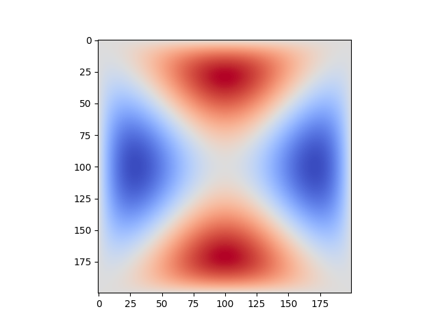
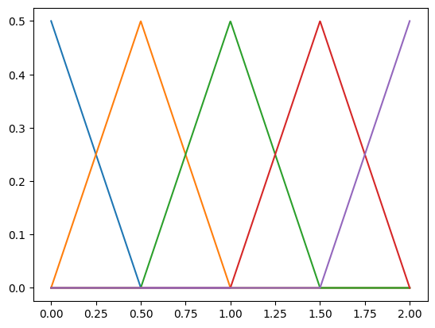
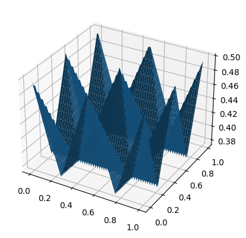
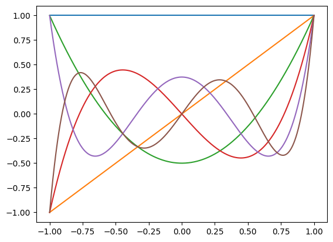
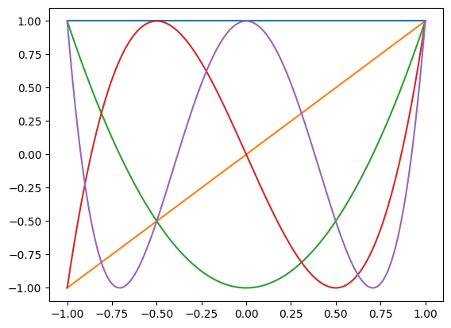
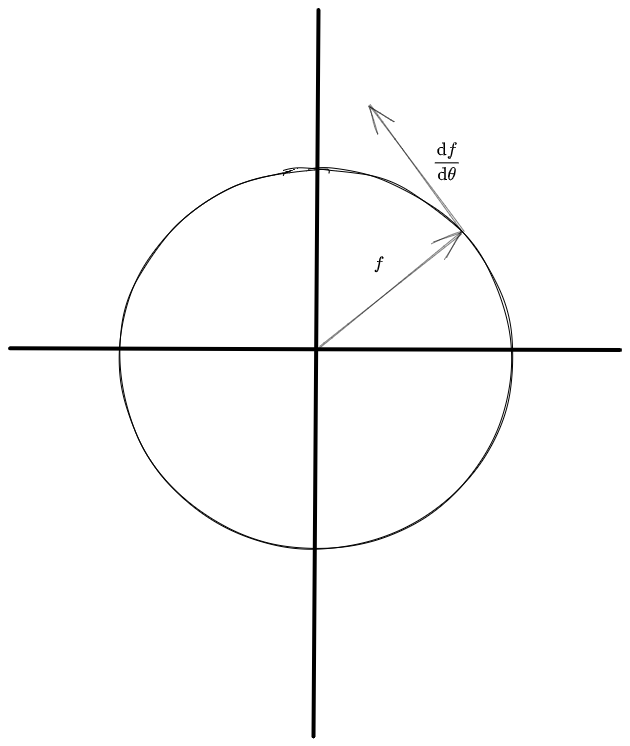

Covering:

- Finite element methods,
- Various bases,
- Fourier/DCT transforms,
- Fourier analysis (faster solvers),
- Fourier analysis (stability/convergence).

-----

# Finite Element Methods

{ width=300px }

In finite element methods, you approximate a function $f$ as a sum of trial functions, $$f(x)\approx \sum_{j=1}^n c_j\Phi_j,$$then test the approximation using test functions $\{\Psi_i\}_{i=1}^m$. The test is whether $$\int_{0}^1\sum_{j=1}^nc_j\Phi_j(x)\Psi_\text{test}(x)\text{d}x = \int_{0}^1 f(x)\Psi_\text{test}(x)\text{d}x$$for every test function. To save room, mathematicians use the notation $\langle u, \Psi\rangle$ to refer to the  [inner product](https://mathworld.wolfram.com/InnerProduct.html) $$\int_{0}^1 f(x)\Psi(x)\text{d}x.$$Sometimes it's useful to insert a nonnegative weight $w$, so $$\langle f,\Psi\rangle_w = \int_0^1 f(x)\Psi(x)w(x)\text{d}x.$$Writing the test equations in matrix form gives $$\begin{bmatrix}\langle \Psi_1, \Phi_1\rangle&\langle \Psi_1, \Phi_2\rangle&\cdots&\langle \Psi_1, \Phi_n\rangle\\\langle \Psi_2, \Phi_1\rangle&\langle \Psi_2, \Phi_2\rangle&\cdots&\langle \Psi_2, \Phi_n\rangle\\\vdots&\vdots&\ddots&\vdots\\\langle \Psi_m, \Phi_1\rangle&\langle \Psi_m, \Phi_2\rangle&\cdots&\langle \Psi_m, \Phi_n\rangle\end{bmatrix}\begin{bmatrix}c_1\\c_2\\\vdots\\c_n\end{bmatrix} = \begin{bmatrix}\langle \Psi_1, f\rangle\\\langle \Psi_2, f\rangle\\\vdots\\\langle \Psi_m, f\rangle\end{bmatrix},$$or in [bra-ket notation](https://en.wikipedia.org/wiki/Bra%E2%80%93ket_notation), $$\langle \Psi|\langle\Phi|\textbf{c}\rangle|w\rangle = \langle\Psi |f| w\rangle.$$To solve the Poisson equation ($\nabla^2 u = f$), we can approximate $u$ as a sum of basis functions, and solve $$\langle \Psi|\langle\nabla^2\Phi|\textbf{c}\rangle|w\rangle = \langle\Psi |f| w\rangle.$$
Then $u\approx \langle \Phi | \textbf{c}\rangle$.

Usually the test and trial bases are the same. Also, we can solve the system faster if the matrix has a small bandwidth; in particular orthogonal functions ($\langle \Phi_i, \Phi_j\rangle = 0$ for $i\ne j$) will give a diagonal system. In addition, it's good if they are easy to integrate and differentiate. Some common bases include hat functions, Legendre polynomials, and the Chebyshev polynomials.

For large systems, you divide the structure into a mesh and choose a basis for each cell (usually the same basis but shifted over). Outside its cell each function is defined to be zero so you only need to take inner products between functions within a cell. To keep it smooth across cells, you create boundary conditions, evaluating the function and its derivatives at the boundary. The Bernstein bases are particularly good for this, as although they are not orthogonal most of them vanish on the boundary ([source](https://boundaryvalueproblems.springeropen.com/articles/10.1155/2011/829543)).

-----

# Common Bases
## Hat Functions

{ width=300px }

The hat functions have a peak at the center of their cell. An equivalent basis would put a line with positive slope and a line with negative slope in each cell, so the hat functions are also called the "piecewise linear basis". We can extend them to higher dimensions using a tensor product, $$\Phi^{2D} = \Phi^{1D}\otimes\Phi^{1D}\Longleftrightarrow \Phi_{ij}^{2D} = \Phi_i^{1D}\Phi_j^{1D}.$$Here I've shown the top half of some two dimensional hat functions (the pyramids should continue down after intersection):

{ width=300px }

There is no weight for these bases, i.e. $w\equiv 1$. For solving the Poisson equation, the second derivative is zero, so $$\langle \Psi|\langle\nabla^2\Phi|\textbf{c}\rangle|1\rangle = \langle\Psi |f| 1\rangle$$looks like it'll become $$0 = \langle\Psi|f|1\rangle,$$which doesn't really work. Luckily, the product rule comes to the rescue. We have $$\nabla\cdot (\Psi\nabla\Phi) = \nabla\Psi\cdot \nabla\Phi + \Psi\nabla^2\Phi\implies \int_{0}^{1}\Psi\nabla^2\Phi\text{d}x = \Psi\nabla\Phi\biggr\rvert_0^1 - \int_0^1\nabla\Psi\cdot\nabla\Phi\text{d}x.$$As $$\Psi(0) = \Psi(1) = 0,$$this reduces to $$\langle \Psi, \nabla^2\Phi\rangle = -\langle\nabla\Psi, \nabla\Phi\rangle.$$This trick is often called integration by parts. We need to solve $$-\langle\nabla \Psi|\langle\nabla\Phi|\textbf{c}\rangle|w\rangle = \langle\Psi |f| 1\rangle.$$In one dimension we find $$-\langle \Psi_i', \Phi_j'\rangle = \begin{cases}-1&i=j\\0.5&|i-j|=1\\0&\text{otherwise}.\end{cases}$$The finite element matrix ends up being the exact same as the finite difference one, times a constant. This happens in general for all dimensions, e.g. the two dimensional hat functions will give rise to the nine-point stencil finite difference matrix. The only difference from the finite difference equation is the right hand side, where we convolve $f$ with the hat function rather than taking a single point.

## Legendre Polynomials

{ width=300px }

Again, no weight for this basis, although the bounds on the integral go from minus one to one: $$\langle P_i, P_j\rangle = \int_{-1}^{1} P_i(x)P_j(x)\text{d}x.$$The Legendre polynomials are orthogonal, and can be computed via Bonnet's recursion formula: $$P_0=1;\quad P_1=x;\quad P_{n+1} = \frac{(2n+1)xP_n - nP_{n-1}}{n+1}.$$Due to orthogonality, the approximation formula $$\langle \Psi|\langle\Phi|\textbf{c}\rangle|w\rangle = \langle\Psi |f| w\rangle,$$reduces to $$c_i = \frac{\langle P_i, f\rangle}{\langle P_i, P_i\rangle}.$$Solving the Poisson equation would give a much denser matrix.

## Chebyshev Polynomials

{ width=300px }

The Chebyshev polynomials are defined by $$T_n(\cos(x)) = \cos(nx),$$and satisfy the recurrence $$T_0=1;\quad T_1=x;\quad T_{n+1} = 2xT_n - T_{n-1}.$$Under the inner product $$\langle T_i, T_j\rangle = \int_{-1}^1 \frac{T_i(x)T_j(x)}{\sqrt{1-x^2}}\text{d}x$$(i.e. $w(x) = 1/\sqrt{1-x^2}$) we get $$\langle T_i, T_j\rangle = \begin{cases}\pi&i=j=0\\\pi/2&i=j\ne0\\0&\text{otherwise},\end{cases}$$so the approximation formula would reduce to $$c_0 = \frac1\pi\langle f, 1\rangle;\quad c_{i} = \frac{2}{\pi}\langle f, T_i\rangle.$$Integrating and multiplying together Chebyshev polynomials is also pretty quick: $$\begin{aligned}\int T_n \text{d}x = \frac12\left(\frac{T_{n+1}}{n+1}-\frac{T_{n-1}}{n-1}\right),\\T_aT_b = \frac12(T_{a+b}+T_{a-b}).\end{aligned}$$Unfortunately, taking derivatives is not so nice, though it can be sped up with the discrete cosine transform (e.g. see [chebfun](https://www.chebfun.org/)).

# Fourier Transforms
## Euler's Formula

Every positive number has two square roots, $+\sqrt{x}$ and $-\sqrt{x}$. When Cardano discovered the [cubic formula](https://en.wikipedia.org/wiki/Cubic_equation), he found expressions involving the root of a negative number. He tried inventing a number $i = \sqrt{-1}$, plugged it in, and got out the correct roots.

Two hundred years later, de Moivre noticed every complex number could be written in *polar form*, $$a + bi = r(\cos\theta + i\sin\theta) = f(r, \theta).$$Multiplying two complex numbers resulted in multiplying their magnitudes and adding their angles, $f(r_1, \theta_1)\cdot f(r_2,\theta_2) = f(r_1r_2, \theta_1+\theta_2).$ This implies you could write it as $$f(r, \theta) = r\cdot\text{base}^\theta$$for some base. Taking a derivative with respect to $\theta$ gives $$f'(r, \theta) = f(r, \theta)\ln\text{base},$$and a picture reveals this is perpendicular to $f$.

{ width=200px }

Therefore, $\ln\text{base} = f(1, 90^{\circ}) = i.$ Plugging this back in, we get Euler's formula, $$\cos\theta+i\sin\theta = e^{i\theta}.$$In particular, $$\cos\theta = \Re(e^{i\theta}) = \frac{e^{i\theta}+e^{-i\theta}}{2}\quad\text{and}\quad\sin\theta = \Im(e^{i\theta}) = \frac{e^{i\theta}-e^{-i\theta}}{2i}.$$Most of the properties of the Chebyshev polynomials can be derived using these formulas.

## Fourier Transforms

The fourier transform takes an arbitrary function $f(t)$ and produces another function in the "frequency domain". It's defined as $$F(y) = \int_{-\infty}^{\infty}f(x)e^{-2\pi i\cdot xy}\text{d}x,$$and is sometimes written $f\leftrightarrow F$. The inverse transform is the complex conjugate, replacing every $i$ with $-i$. The cosine transform is the real part, and the sine transform is the imaginary part.

The discrete versions use a summation rather than an integral: $$F_y = \frac{1}{\sqrt{N}}\sum_{x=0}^{N-1}e^{-\frac{2\pi i}{N}xy}f_x,$$sending $N$ points $f_0, f_1, \dots, f_{N-1}$ in the time domain to $N$ points $F_0, F_1, \dots, F_{N-1}$ in the frequency domain. Written out as a matrix multiplication, this is $$\begin{bmatrix}F_0\\F_1\\F_2\\F_3\\\vdots\\F_{N-1}\end{bmatrix} = \frac{1}{\sqrt N}\begin{bmatrix}1&1&1&1&\cdots&1\\1&\omega&\omega^2&\omega^3&\cdots&\omega^{N-1}\\1&\omega^2&\omega^4&\omega^6&\cdots&\omega^{2(N-1)}\\1&\omega^3&\omega^6&\omega^9&\cdots&\omega^{3(N-1)}\\\vdots&\vdots&\vdots&\vdots&\ddots&\vdots\\1&\omega^{N-1}&\omega^{2(N-1)}&\omega^{3(N-1)}&\cdots&\omega^{(N-1)(N-1)}\end{bmatrix}\begin{bmatrix}f_0\\f_1\\f_2\\f_3\\\vdots\\f_{N-1}\end{bmatrix},$$where $\omega = e^{-\frac{2\pi i}{N}}$ is a root of unity (i.e. $\omega^{N} = 1$). Typically such a matrix-vector multiplication takes $O(N^2)$ time to compute, however we have a lot of repeating values in this matrix. The Cooley-Tukey algorithm takes advantge of this to compute it in only $O(N\log N)$ time.

Let $D$ be the discrete fourier transform "operator" (i.e. matrix). Split up every other element of $f$ into two separate components, $f_\text{even}$ and $f_\text{odd}$. You may need to pad it with an extra zero to make them the same length. Now look at $$\begin{aligned}F_y &= D(f_\text{even}) + (\omega^yD)(f_\text{odd}),\\F_{y+\frac{N}{2}} &= D(f_\text{even}) + (\omega^{y+\frac{N}{2}}D)(f_\text{odd}) = D(f_\text{even}) - (\omega^{y}D)(f_\text{odd}).\end{aligned}$$You can do two smaller fourier transforms ($\frac{N}{2}\times \frac{N}{2}$ matrices) and add/subtract them to get a larger transform! Recursing gives the Cooley-Tukey algorithm. One use is multiplying two polynomials together: you can evaluate each polynomial at the roots of unity, multiply the values together, then apply the inverse fourier transform to get the coefficients of their product.

# Fourier Analysis
(Needs some updating to include discrete cosine transform algorithm.)
Similar to the Taylor series and finite element methods, we can write continuous and periodic functions as a Fourier series: $$u(x) = \sum_{n=-\infty}^{\infty}U_ne^{2\pi in\cdot x}$$for some coefficients $U_n$. Note, this is the same as a finite element approximation using the functions $e^{\pm 2\pi in\cdot x}$, or equivalently, $\cos(2\pi in\cdot x), \sin(2\pi in\cdot x)$ due to Euler's formula. We can use the inner product $$\langle e^{2\pi in\cdot x}, e^{2\pi im\cdot x}\rangle = \int_{0}^1 e^{2\pi in\cdot x}\cdot e^{2\pi im\cdot x}\text{d}x = \begin{cases}1&m+n=0,\\0&\text{otherwise}.\end{cases}$$Nearly everything will cancel out, so we can find an explicit formula for $F_n$: $$U_n = \int_{0}^{1}u(x)e^{-2\pi in\cdot x}\text{d}x.$$The discrete case and two-dimensional case is similar. We can use this to quickly solve the discrete Poisson equation. For example, if $$u(x, y) = \sum_{n=0}^{N-1}\sum_{m=0}^{M-1}U_{n, m}e^{2\pi i (\frac{m}{M}x+\frac{n}{N}y)},$$then the finite difference method is $$\begin{aligned}f = \nabla^2 u&\approx -4u_{0,0}+u_{1,0}+u_{-1,0}+u_{0,1}+u_{0,-1}\\
&=\sum_{n=0}^{N-1}\sum_{m=0}^{M-1}\left(e^{\frac{2i\pi}{M}x}+e^{-\frac{2i\pi}{M}x} + e^{\frac{2i\pi}{N}y} + e^{-\frac{2i\pi}{N}y}-4\right)U_{n, m}e^{2\pi i (\frac{m}{M}x+\frac{n}{N}y)}\\
&= \sum_{n=0}^{N-1}\sum_{m=0}^{M-1}2\left(\cos\left(\frac{\pi x}{M}\right)+\cos\left(\frac{\pi y}{N}\right)-2\right)U_{n, m}e^{2\pi i (\frac{m}{M}x+\frac{n}{N}y)}\end{aligned}$$Taking a 2D discrete fourier transform of $f$ and dividing the coefficients by $$2\left(\cos\left(\frac{\pi x}{M}\right)+\cos\left(\frac{\pi y}{N}\right)-2\right)$$appropriately will give us the coefficients $U$. Then we can take the inverse transform to recover $u$. The periodicity of the Fourier series means it will solve it with von Neumann boundary conditions (derivative across boundaries is zero).

Also, we only need to keep track of the real parts, so we can shave off another factor of two by using the discrete cosine transform (the algorithm is similar to the Cooley-Tukey algorithm). The overall running time goes from $O(N^3)$ to $O(N^2\log N)$.

# [Stability](https://en.wikipedia.org/wiki/Von_Neumann_stability_analysis)

TLDF (will update after class, but didn't end up getting around to this); The Fourier series converges for functions with a continuous derivative. We can analyze the stability of Euler-like methods in Fourier space. If it is stable for all test functions $e^{i\theta t}$ (all on the $\theta$'s) then the Fourier series will stay stable $\implies$ the method is stable.

Example w/ Euler's method:
$$y(t) = e^{i\theta t}\implies y'(t) = \theta y,$$so $$y_{t+1} = (1 + h\theta)y_t,$$will be stable iff $$|1+h\theta| \le 1$$

This describes a circle. Can do similar things for finite difference equations.