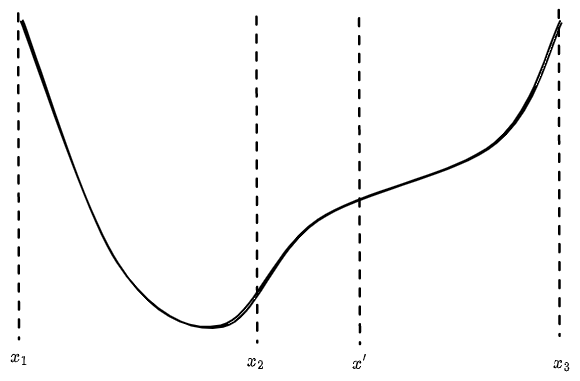

Covering:

- Optimization methods, such as:
- Binary and golden-section search,
- The simplex method,
- Gradient descent, conjugate gradient descent, and Adam.

-----

# Line Search

## Binary Search

{ width=300px }

Say you have a continuous function $f$, and you know two points where $$f(x_1) > 0,\quad f(x_2) < 0.$$There must be some point in between where $f(x^*) = 0$. You can do a binary search to find this root: Create a new point $$x' = \frac{x_1+x_2}{2},$$and if $f(x') > 0$ replace $x_1\leftarrow x'$, otherwise $f(x') < 0$ so we can replace $x_2\leftarrow x'$. Each update halves the region the root may be in, so after $n$ iterations we know the root within an error bound of $O(2^{-n})$. Thus, this method is linear. Note that Newton's method is quadratic, but it isn't guaranteed to converge.

## Golden-Section Search

{ width=300px }

Golden-section search is a similar idea to find extrema. Say we have three points $x_1, x_2, x_3$ such that $$f(x_2) < f(x_1), f(x_3),$$which means there is a local minimum between $x_1$ and $x_3$. We create a new point, $x'$, and compare $f(x')$ to $f(x_2)$. If it is larger, then there is a local minimum between $x_1$ and $x_2$, otherwise it is between $x_2$ and $x_3$. The update rule is $$(x_1, x_3, x_3)\leftarrow\begin{cases}(x_1, x_2, x')&f(x') > f(x_2)\\(x_2, x', x_3)&f(x') \le f(x_2).\end{cases}$$To keep the evaluation points evenly spaced, we want $$\frac{|x_2-x_3|}{|x_1-x_2|} = \frac{|x_1-x_2|}{|x_2-x'|}=\frac{|x'-x_3|}{|x_2-x'|},$$which ends up being the golden ratio $$\varphi = \frac{\sqrt{5}-1}{2}.$$Also, notice that we may need to put $x'$ on the other side of $x_2$, in which case the update rule changes slightly. Like with binary search, the region where the minimum may be will decrease exponentially.

For both of these methods, we've assumed we had some initial points. If we don't, we can increase the gap between the left and right points until we find some. A weakness for these methods is they only work in 1D.

-----

# Linear Programming Problem

{ width=300px }

A *linear programming problem* (LP) has the canonical form $$\text{maximize }\mathbf{c^T x},\quad \text{under the constraints }A\textbf{x}\le \textbf{b},\ \mathbf{x\ge 0}$$where $x, b, c$ are vectors and $A$ is some constraint matrix. These problems often arise in economics and statistics.

For example, say you wish to maximize your victory points in the game of Settlers of Catan. It costs two wheat and three ore to build a city, one sheep, wheat, and ore to build a development card, or one of everything except ore to build a settlement. Each of these amount to one victory point. The linear programming problem would be: $$\text{maximize \# cities }+\text{ \# cards }+\text{ \# settlements}$$given $$\begin{bmatrix}0&0&1\\0&1&1\\2&1&1\\3&1&0\\0&0&1\end{bmatrix}\begin{bmatrix}\text{\# cities}\\\text{\# cards}\\\text{\# settlements}\end{bmatrix}\le \begin{bmatrix}\text{\# lumber}\\\text{\# sheep}\\\text{\# wheat}\\\text{\# ore}\\\text{\# bricks}\end{bmatrix}.$$The inequalities create half-spaces of feasible regions, and the intersection of all these half-spaces is a convex region. Thus, the maximum of $\mathbf{c^T x}$ will be at some vertex of this region.

The *simplex method* chooses some random vertex, then continually moves to neighboring vertices with higher values of $\mathbf{c^T x}$. First we append "slack variables" to convert the inequalities to equalities. For example, $$x_1+3x_2\le 5$$would become $$x_1+3x_2+s = 5, \quad s\ge 0.$$Initially only the slack variables are nonzero. To move between vertices, we switch out a slack variable for one of the others. It's helpful to write our LP as a tableau, in the form $$\begin{bmatrix}-\mathbf{c^T}&\mathbf{0}&=&0\\A&I&=&\mathbf{b}\end{bmatrix}.$$The slack variables correspond to the $\begin{bmatrix}0&I\end{bmatrix}^T$ column. The right columns equal our slack variables, or the value of our objective in the case of the top row. In our Settlers of Catan example the canonical tableau is $$\begin{bmatrix}
-1&-1&-1&\vert&0&0&0&0&0&=&0 \\
\hline
0&0&1&\vert&1&0&0&0&0&=&\ell \\
0&1&1&\vert&0&1&0&0&0&=&s \\
2&1&1&\vert&0&0&1&0&0&=&w \\
3&1&0&\vert&0&0&0&1&0&=&o \\
0&0&1&\vert&0&0&0&0&1&=&b \\
\end{bmatrix}.$$As long as the top row (called the objective row) has negative entries, we can do better. Say we want to switch out our first variable (the number of cities) for a slack variable. That would mean turning the first column into a string of zeros with a single one, then swapping with the corresponding column in the slack area.

For example, say we selected the fourth row to contain the single one. Dividing by two and subtracting it from the first and fifth rows gives $$\begin{bmatrix}0&-0.5&-0.5&\vert&0&0&0.5&0&0&=&w/2\\\hline0&0&1&\vert&1&0&0&0&0&=&\ell\\0&1&1&\vert&0&1&0&0&0&=&s\\1&0.5&0.5&\vert&0&0&0.5&0&0&=&w/2\\0&-0.5&-1.5&\vert&0&0&-1.5&1&0&=&o-3w/2\\0&0&1&\vert&0&0&0&0&1&=&b\end{bmatrix},$$and then swapping columns gives $$\begin{bmatrix}0.5&-0.5&-0.5&\vert&0&0&0&0&0&=&w/2\\\hline0&0&1&\vert&1&0&0&0&0&=&\ell\\0&1&1&\vert&0&1&0&0&0&=&s\\0.5&0.5&0.5&\vert&0&0&1&0&0&=&w/2\\-1.5&-0.5&-1.5&\vert&0&0&0&1&0&=&o-3w/2\\0&0&1&\vert&0&0&0&0&1&=&b\end{bmatrix}.$$We can keep pivoting like this until there are no more negative values in the objective row. When pivoting we have to be careful none of the slack variables become negative, which will happen if we choose the row that minimizes $$\frac{\text{right column value}}{\text{pivot column value}}$$and has a positive pivot column value. The simplex method may end up cycling, but Bland's rule prevents this: Choose the lowest-numbered variable for pivoting, and in the event of ties for the row, choose the lower row.

The simplex method has been shown to take exponentially long on *some* problems (see [here](https://glossary.informs.org/notes/Klee-Minty.pdf)), but is often pretty quick. A guaranteed polynomial-time algorithm is the [ellipsoid method](https://en.wikipedia.org/wiki/Ellipsoid_method). It creates an ellipsoid around the feasible region, queries a point in the middle of the ellipsoid, and creates an additional constraint that the objective must be larger than this value. This gives a new feasible region (and ellipsoid), and slowly the ellipsoid shrinks until you're left with the maximum. It's a similar idea to binary or golden-section search, just for more dimensions. No one actually uses the ellipsoid method, because usually the simplex method is quicker.

-----

# Gradient Descent

The gradient is the partial derivative w.r.t. each variable, i.e. $$\nabla f(x_1, x_2, \dots, x_n) = \begin{bmatrix}\partial f/\partial x_1\\\partial f/\partial x_2\\\vdots\\\partial f/\partial x_n\end{bmatrix}.$$For nonlinear optimization problems, you can move along the gradient to find a maximum (i.e. gradient *ascent*), or in the opposite direction to find a minimum (i.e. gradient *descent*). $$x\leftarrow x - \alpha \nabla f$$for some step size $\alpha$. If you don't know the gradient you can approximate it with a finite difference, though that will take many function evaluations. The best step size is a tricky problem. You could do a line search (e.g. golden-section search) in the gradient direction, which would be the "optimal" step size, but that would require many function evaluations (and might not actually be optimal). We'll discuss one optimizer called Adam in the section on neural networks.

-----

## Conjugate Gradient Method

You can also turn a linear problem into a nonlinear one. For example, to solve $$\mathbf{Ax = b}$$you can rewrite it as $$\text{minimize } \frac12\mathbf{x^T Ax - x^T b},$$which is optimized when the gradient, $\frac12[\mathbf{A^T x}+\mathbf{Ax}]-\mathbf{b}$, is zero. The *conjugate gradient method* takes advantage of this to quickly solve matrix equations. It will only work when $\mathbf{A^T x = Ax}$ i.e. we have a symmetric matrix. We also need it to be positive-definite ($\mathbf{x^T Ax} > 0$ for $\mathbf{x}\ne 0$) and real-valued.

Define two inner products between vectors, the standard one $$u\cdot v = u^T v$$and $$\langle u, v\rangle = u^TAv.$$Two vectors are *conjugate* w.r.t. $A$ if $\langle u, v\rangle = 0$. We can write $x$ as a sum of conjugate vectors, $$x = \sum \alpha_i p_i, $$which implies $$p_k^Tb = p_k^TAx = p_k^TA\sum \alpha_i p_i = \sum \alpha_i\langle p_k, p_i\rangle = \alpha_k\langle p_k, p_k\rangle,$$and hence $$\alpha_k = \frac{p_k\cdot b}{\langle p_k, p_k\rangle}.$$Maybe the matrix $A$ is very large, so we only want to perform a few iterations. There are many bases $\mathbf{p}$ that would work; if we choose $p_k$ so that it is close to the gradient, $Ax_k-b$, then it should converge pretty fast. Let $r_k = b-Ax_{k}$ be the residual value. We can choose $$p_k = r_k - \sum_{i < k}\frac{\langle p_i, r_k\rangle}{\langle p_i, p_i\rangle}p_i,$$which ensures this direction will be close to the gradient (in the opposite direction) and conjugate to all the previously chosen vectors (via the Gram-Schmidt process). Then we can make the update $$x_{k+1} = x_k + \alpha_kp_k = x_k + \frac{p_k\cdot b}{\langle p_k, p_k\rangle}p_k = x_k+\frac{p_k\cdot r_k}{\langle p_k, p_k\rangle}p_k = x_k + \frac{r_k\cdot r_k}{\langle p_k, p_k\rangle}p_k,$$as $$p_k\cdot (b-r_k) = p_k^TAx_k = p_k^TA\sum_{i<k}\alpha_ip_i = 0,$$and also $$\begin{aligned}(r_k-p_k)\cdot r_k
&= \left(\sum_{i < k}\frac{\langle p_i, r_k\rangle}{\langle p_i, p_i\rangle}p_i\right)\cdot \left(b-A\sum_{i<k}\alpha_ip_i\right)
\\&= \sum_{i<k}\langle p_i, r_k\rangle\frac{p_i^Tb}{\langle p_i, p_i\rangle} - \sum_{i < k}\frac{\langle p_i, r_k\rangle}{\langle p_i, p_i\rangle}\alpha_i\langle p_i, p_i\rangle
\\&=\sum_{i<k}\alpha_i \langle p_i, r_k\rangle - \sum_{i<k}\alpha_i \langle p_i, r_k\rangle
\\&= 0.\end{aligned}$$It also turns out (after a lot of algebra) that $$p_{k+1} = r_{k+1}+\frac{r_{k+1}\cdot r_{k+1}}{r_k\cdot r_k}p_k,$$so we do not need to store all previous directions. This gives a quick algorithm:

```python
x = 0
r = b - A @ x
p = copy(r)
while True:
    r_prev = copy(r)
    a = (r @ r) / (p @ (A @ p))
    x += a * p
    r -= a * (A @ p)
    p = r + (r @ r) / (r_prev @ r_prev) * p
    
    if np.linalg.norm(r) < epsilon:
        break
```

For an $N\times N$ matrix, and stopping after $n$ iterations, the running time would be $O(nN^2)$. Using $n=N$ iterations would give the exact solution. Note that solving a matrix equation with row reduction takes $O(N^3)$ time.

For sparse matrices, such as the finite difference matrix for the Poisson equation, we can compute $\mathbf{Ap}$ much quicker. In this case it will only take $O(nN)$ time in 1D, and $O(nN^2)$ time with two dimensions, where this time $N$ is the number of gridpoints in each direction.

-----

## Neural Networks

The most famous use of gradient descent is training neural nets. Each layer of a neural net is just a matrix-vector multiplication, plus some nonlinear activation function. If there wasn't the nonlinear function we would have $$y_\text{out} = A_\ell(A_{\ell-1}(\cdots A_1x_\text{in})) = (A_\ell A_{\ell-1}\cdots A_1)x_\text{in},$$so the entire neural net could be written as a single matrix-vector multiplication. The most common nonlinear function is the *rectified linear unit* (ReLU), which is a complicated name for $$\sigma(x)_i = \max(0, x_i).$$I guess someone didn't think "stay positive" was good enough advice to be published in a computer science journal. For probabilities, the *softmax function* is used, which is defined as $$\sigma(x)_i = \frac{e^{x_i}}{\sum_j e^{x_j}},$$and is derived by maximizing entropy (see [here](https://github.com/WinVector/Examples/raw/main/dfiles/LogisticRegressionMaxEnt.pdf)). For a binary classifier you can combine the two outputs into a single one, and use the *sigmoid*, $\frac{1}{1+e^{-x}}$, instead. There are many other less common activation functions out there. The [universal approximation theorem](https://en.wikipedia.org/wiki/Universal_approximation_theorem) says that a neural network (with a sufficient number of layers or size of matrices) can approximate any function arbitrarily well.

You can create a loss function, such as mean-squared loss, that computes how far off the neural network outputs are from the correct values. It would be expensive to run the neural net through every single input/output in the dataset, so you usually take small batches to approximate the loss (~1K datums for large models, ~64 for stuff you train at home). For probabilities or labelling images, you should use the [cross-entropy](https://en.wikipedia.org/wiki/Cross_entropy) loss, which is basically the [KL divergence](https://en.wikipedia.org/wiki/Kullback%E2%80%93Leibler_divergence#Definition) without caring about your data's entropy, and hence more robust to the batching. This batching idea is known as *stochastic* gradient descent (SGD). Taking a gradient of the loss function, and then backpropagating the gradient through the rest of the layers gives you the gradient for each parameter of the network.

However, you still need to find the right step size. Too large, and your parameters will fly around without ever finding an optimum, but too small and you will never converge. The *Adam* method uses the noise in the gradient to choose a good step size. If one of the derivatives is rapidly switching between positive and negative values, it means that parameter is probably pretty optimal.

In particular, you multiply your initial step size $\alpha$ by the first moment over the second moment, $$\frac{\sum \partial f/\partial x}{\sqrt{\sum (\partial f/\partial x)^2}} = \frac{m_1}{m_2}.$$You don't want to have to keep track of the derivatives for every iteration, so you take a moving average instead: $$\begin{aligned}m_1&\leftarrow \beta m_1 + (1-\beta)\frac{\partial f}{\partial x},
\\ m_2&\leftarrow \beta m_2+(1-\beta)\left(\frac{\partial f}{\partial x}\right)^2,\end{aligned}$$for some $\beta\approx 1$ (but less than; e.g. $\beta=0.999$). The update is then $$x\leftarrow x - \alpha\cdot \frac{m_1}{m_2}.$$When the gradients are all pointing in the same direction, then $m_2\approx m_1$, so the step size will be about $\alpha$. As you get near an optimum, $m_1$ will go to zero and $m_2$ will approximate the variance, which should be much larger, so the step size will decrease to zero.

-----

\newpage

# Homework Problems
1. **Computer Science:** Given two sorted lists, $\mathbf{a}$ and $\mathbf{b}$, find the median of their concatenation in $O(\log n)$ time and constant space.
2. **Math:** Show that the golden ratio is the correct ratio for the golden-section search.
3. **Math:** Consider the linear program $$\min c^Tx,\quad \mathbf{Ax=b},\quad\mathbf{x\ge 0}.$$Define the *Lagrangian* as $$\mathcal{L}(x, \nu, \lambda) = c^Tx + \nu^T(Ax-b)+\lambda^Tx.$$What constraints are equivalent to $\partial\mathcal{L}/\partial x_i = 0?$ This is known as the *dual problem*. Find the dual problem of the Settler's of Catan example, and explain what it represents.
4. **Coding:** Code up a neural network from scratch, and implement gradient descent. Try it on the `XOR` function.
